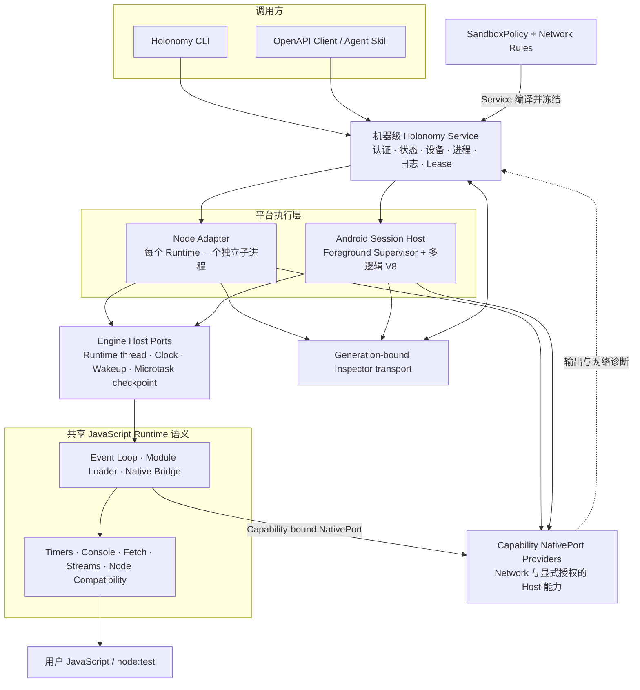
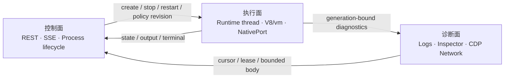

# 整体架构

[English](../en/concepts/architecture.md)

Holonomy 把用户交互、长期资源管理、平台执行和公共 JavaScript 语义分成四层。Service 是唯一长期资源 owner，Node 与 Android Adapter 只实现各自平台的执行边界。

CLI 负责编译本地入口和呈现结果，不持有后台资源。Service 统一管理 Node、Android、ADB、AVD、Process、Network Rules 和 Inspector lease。共享 Runtime 拥有公开 JavaScript 行为；Engine Host Ports 提供 Runtime thread、时钟和唤醒等执行原语，Capability NativePort Providers 提供显式授权的 Host 能力，Inspector 则使用独立、generation-bound 的诊断传输。

## 控制面与数据面

三个平面共享 `processId + generation` 身份。旧 generation 的控制请求、输出或 Inspector 连接不能作用于新 Runtime。
