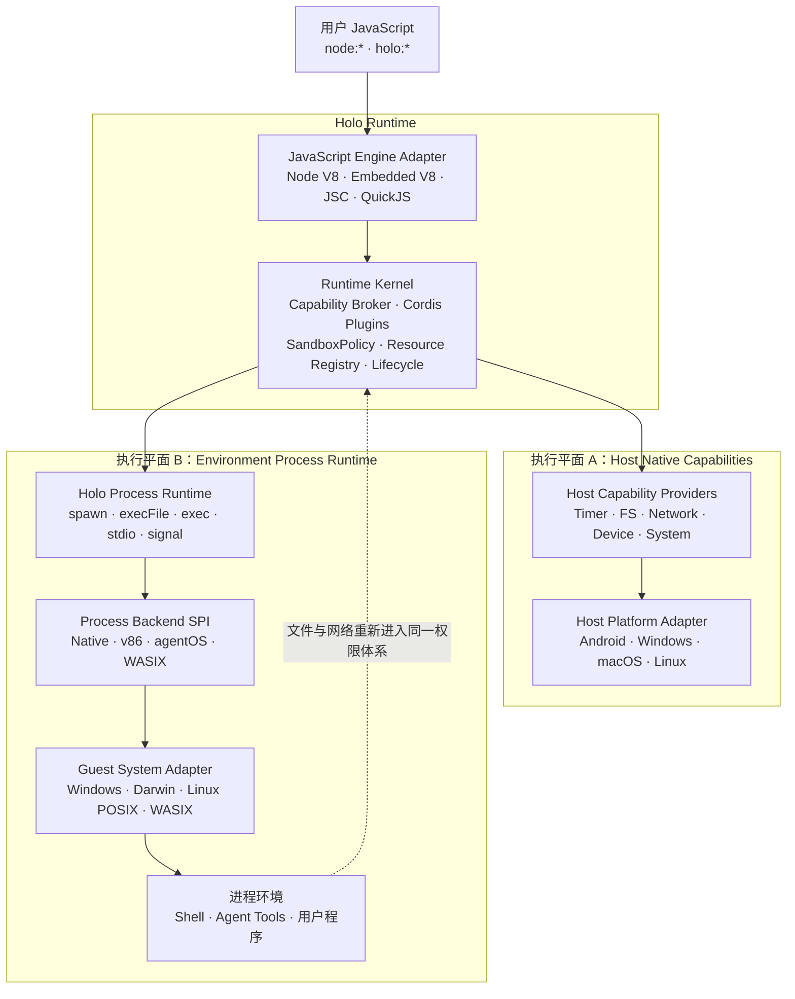
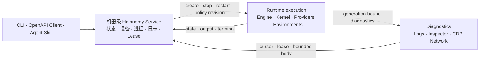

# 整体架构

[English](../en/concepts/architecture.md)

Holonomy 用一个共享 Runtime Kernel 连接两个执行平面：普通 Host 能力直接由平台 Provider 实现，需要操作系统环境的进程能力则交给可插拔 Environment Backend。两条路径共用同一个 SandboxPolicy、Cordis 插件链、Capability Broker、Resource Registry 和 generation 生命周期。



`Host Native Capability Providers` 负责 timer、文件、网络、设备和系统信息等能力。`Process Backend SPI` 只抽象进程环境，不是第二套通用 Native Bridge。Linux 内的文件和网络访问必须携带 environment、进程和资源身份重新进入 Kernel，不能借虚拟机绕过 Host Policy。

## Workspace 代码边界

真实实现按职责拆为独立 workspace 包：

```text
packages/runtime/                 Runtime Kernel、Cordis App、通用 JS Runtime 叶子
packages/capabilities/fs/         node:fs 与文件资源合同
packages/capabilities/device/     holo:device 与设备事件合同
packages/capabilities/system/     node:os / node:process Host 投影合同
packages/capabilities/network/    Fetch、网络调用与 Linux 网络桥
packages/capabilities/process/    node:child_process 与进程资源协议
backends/                         v86、agentOS、WASIX 等 Environment Backend 资产
adapters/                         Node、Android、Desktop 等 Host/Engine/Provider 实现
```

仓库根部的 `src/` 只保留未分包前公开路径的兼容导出，不再拥有实现。新增 Runtime 逻辑进入 `packages/runtime`，新增 Capability 逻辑进入相应 `packages/capabilities/*`；Host I/O 不得放进这些平台无关包。

## 四个独立组合轴

平台、JavaScript 引擎、进程 Backend 和进程内系统语义互不等价：

| 维度                | 负责什么                                             | 示例                                |
| ------------------- | ---------------------------------------------------- | ----------------------------------- |
| Host Platform       | Runtime 运行在哪里及如何取得原生资源                 | Android、Windows、macOS、Linux      |
| JavaScript Engine   | Realm、模块执行、microtask、Inspector 与 Engine Gate | Node V8、Embedded V8、JSC、QuickJS  |
| Environment Backend | 在哪里以及如何创建进程环境                           | Native、v86、agentOS、WASIX         |
| Guest System        | path、argv、shell、signal、process tree 等系统语义   | Windows、Darwin、Linux POSIX、WASIX |

因此 Desktop 只是产品形态，不等于 Node 或 V8。一个 Desktop Host 可以使用 Embedded V8、JSC 或 QuickJS，也可以选择 Native、v86 或其他 Backend；每个实际组合都必须由自己的 descriptor、适配器和 E2E 证据声明能力，不能借用另一组合的支持结论。

Windows 同样需要独立 System Adapter，明确 `CreateProcess` quoting、`cmd.exe`、drive/UNC path、环境变量大小写、HANDLE/pipe、Job Object、signal 与错误映射。平台差异应收敛在 Host/System Adapter，不进入公共 `node:*` facade 或 v86 Driver。

## 控制面与生命周期



CLI 只编译入口并呈现结果；Service 是长期资源 owner。控制、执行和诊断共享 `processId + generation`，旧 generation 的请求、资源、事件和 Inspector 连接不能作用于新 Runtime。
