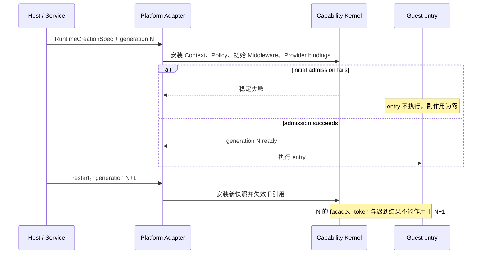

# 安全能力内核

[English](../en/concepts/capability-runtime.md)

Holonomy 的安全能力内核把 Runtime 创建、权限上限、业务拦截和真实平台执行分开。Filesystem、Device、System、Network 与安全 Runtime Plugin graph 的 `provider-v1` 已完成 M3 平台验收；支持范围仍严格受下方矩阵约束。

## 调用链

```mermaid
flowchart LR
  host["可信 Host"]
  service["Service 准入<br/>Context · Policy · Middleware · Provider bindings"]
  runtime["Generation-bound RuntimeCreationSpec"]
  guest["Guest<br/>node:* / holo:* facade"]
  snapshot["参数快照 + CanonicalResource"]
  policy["SandboxPolicy v2<br/>不可放大的硬上限"]
  system["System layer"]
  middleware["Host Koa Middleware"]
  authority["Provider authority"]
  provider["Node/Desktop 或 Android Provider"]
  result["结果校验 + Guest error translation"]

  host --> service --> runtime --> guest
  guest --> snapshot --> policy --> system --> middleware --> authority --> provider --> result --> guest
```

同一次 facade 调用只使用一份冻结的参数快照和资源身份。Middleware 可以拒绝、短路或继续，但不能扩大 Policy；Provider 在真实执行前仍会核对自己的最小 authority。Network 的首请求和每个 redirect hop 都重新准入；Response metadata/body/clone 以 generation-bound resource token 作为 `systemOnly` continuation 重入 Policy、quota 与 Provider，但不重复执行 Host 业务授权插件。

## 原子启动与重启

Runtime Context 由 Host 在创建时提供，并分别产生 Host、Guest 与 Inspector 投影。Guest 只能通过 `holo:runtime` 读取 Guest 投影，不能声明自己的身份或取得 Host 私有字段。

## 当前 `provider-v1`

| 场景                         | Node/Desktop                                                     | Android 模拟器                                                 |
| ---------------------------- | ---------------------------------------------------------------- | -------------------------------------------------------------- |
| 原子安装与初始失败 `entry=0` | 已验证                                                           | 已验证                                                         |
| `holo:runtime` Guest Context | 已验证                                                           | 已验证                                                         |
| Sandbox filesystem v1        | 附录 H 声明surface的同一Guest conformance、resource/overflow反例 | 同一Guest conformance及resource/overflow/Abort/quota反例       |
| Host System Projection       | 已声明字段的 real/synthetic/redacted/unavailable                 | 已声明字段的 real/synthetic/redacted/unavailable               |
| Device Provider              | 当前适配器发布Headless Node descriptor；不声明Desktop事件profile | Android required读数、真实平台change、revision/resync与fencing |
| Network                      | real/mock、redirect、Response、DNS/private-IP、Rules 与诊断      | mock continuation、私网 DNS 拒绝、Response、Rules、取消与诊断  |
| restart generation fencing   | 已验证                                                           | 已验证                                                         |

文件系统仍只暴露 Host 配置的 `holo-fs://` 虚拟根，不公开宿主原生路径。Runtime Plugin 可通过 `holo-plugins:///*` Bundle 启动装载；Node/Desktop 已将独立 Host realm、Capability Middleware graph/drain 与 Permission/Audit 基础 factory 接入 Broker。Android v1 使用独立 Host V8 realm 的静态同步插件子集，并把同步 Capability interception 接入同一 Broker；动态 replacement 仍不开放。

## 不属于当前声明

- 附录 H 没有声明的其他 `node:fs` API 或任意宿主路径访问。
- Android Runtime Plugin 动态 replacement；Android 只支持启动时静态 Bundle。
- WebSocket 客户端传输；当前安装的是固定、可检测的 unsupported facade。
- v86 的 `/workspace` 之外 POSIX 文件面、物理 Android、64-bit/multicore 与真正 VM snapshot/restore；当前 Experimental v1 已覆盖受控 TCP/UDP/DNS、Host Device/System 投影和 Android 后代 exec gate。
- 逐次 eval/Function prompt 或完整 Observer。
- 用模拟器结果代替 Android 物理设备验收。

精确状态见[支持矩阵](../capabilities/support-matrix.md)，策略边界见 [SandboxPolicy](../reference/sandbox-policy.md)。
