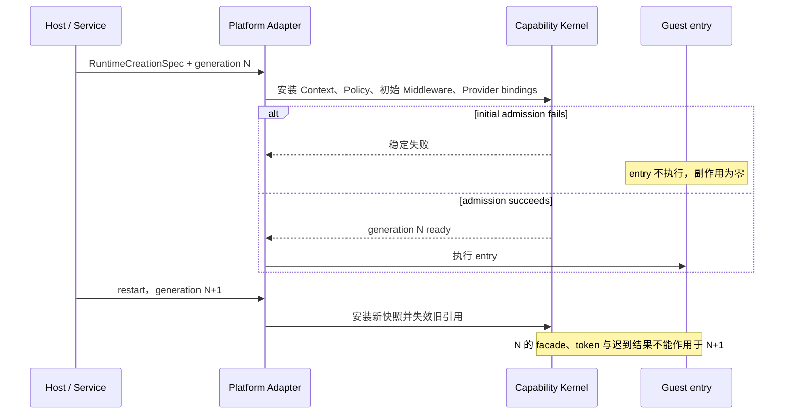

# 安全能力内核

[English](../en/concepts/capability-runtime.md)

Holonomy 的安全能力内核把 Runtime 创建、权限上限、业务拦截和真实平台执行分开。当前已开放的是 `kernel-slice`：用于验证 Node/Desktop 与 Android 模拟器共享同一套安全流水线，不代表完整生产 Provider 已经完成。

## 调用链

```mermaid
flowchart LR
  host["可信 Host"]
  service["Service 准入<br/>Context · Policy · Middleware · Provider bindings"]
  runtime["Generation-bound RuntimeCreationSpec"]
  guest["Guest<br/>node:* / holo:* facade"]
  snapshot["参数快照 + CanonicalResource"]
  policy["SandboxPolicy v2<br/>不可放大的硬上限"]
  system["System layer"]
  middleware["Host Koa Middleware"]
  authority["Provider authority"]
  provider["Node/Desktop 或 Android Provider"]
  result["结果校验 + Guest error translation"]

  host --> service --> runtime --> guest
  guest --> snapshot --> policy --> system --> middleware --> authority --> provider --> result --> guest
```

同一次已开放的 facade 调用只使用一份冻结的参数快照和资源身份。Middleware 可以拒绝、短路或继续，但不能扩大 Policy；Provider 在真实执行前仍会核对自己的最小 authority。当前 `kernel-slice` 的 Network Broker 只准入首个逻辑 Fetch 请求；redirect 与 Response continuation 仍由既有传输层负责，并要求 Capability Network 与传输策略逐字段完全一致。让这些 `systemOnly` continuation 自身重新进入 Broker 属于 M3。

## 原子启动与重启

Runtime Context 由 Host 在创建时提供，并分别产生 Host、Guest 与 Inspector 投影。Guest 只能通过 `holo:runtime` 读取 Guest 投影，不能声明自己的身份或取得 Host 私有字段。

## 当前 `kernel-slice`

| 场景                         | Node/Desktop                     | Android 模拟器                  |
| ---------------------------- | -------------------------------- | ------------------------------- |
| 原子安装与初始失败 `entry=0` | 已验证                           | 已验证                          |
| `holo:runtime` Guest Context | 已验证                           | 已验证                          |
| 受控 workspace 文件读写      | `node:fs` sync/callback/promise  | `node:fs` sync/callback/promise |
| Host System                  | `node:os` 的 `arch()`            | `node:os` 的 `arch()`           |
| Device                       | `holo:device` form factor        | form factor 与 power            |
| Network                      | real 与 mock 的首请求共享 Broker | mock 的首请求共享 Broker        |
| restart generation fencing   | 已验证                           | 已验证                          |

这里的文件系统只开放一个 Host 配置的 `holo-fs://workspace/` 虚拟根、`read`/`write` 权限和严格限额；不会公开宿主原生路径。当前切片也只接受受限的内置 Middleware 描述，尚未发布供接入应用任意注册 UI 或授权逻辑的 Host SDK。

## 不属于当前声明

- 完整 `node:fs` v1 exports、watcher、目录和 handle surface。
- 完整 Host System 字段或 target-compliant `holo:device` Provider。
- 公开的任意 Host Middleware 注册 SDK 和授权 UI 工具包。
- [Cordis Runtime Plugin、`holo-plugins:///` Bundle 与 CLI watch](./runtime-plugins.md) 的目标架构。
- redirect、Response metadata/body 等 `systemOnly` continuation 的 Broker 重入。
- `node:child_process`、逐次 eval/Function prompt 或完整 Observer。
- 用模拟器结果代替 Android 物理设备验收。

精确状态见[支持矩阵](../capabilities/support-matrix.md)，策略边界见 [SandboxPolicy](../reference/sandbox-policy.md)。
