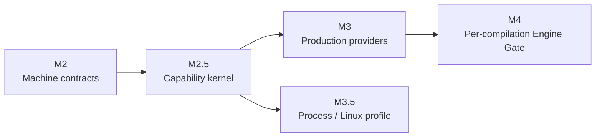

# Runtime 里程碑

[English](../en/concepts/milestones.md)

Holonomy 的 Runtime 路线按能力边界推进，而不是把所有平台功能塞进一次发布。里程碑编号保持稳定：M2 冻结机器合同，M2.5 建立安全能力内核，M3 再扩展生产 Provider；Process/Linux 与逐次 Engine Gate 分别独立推进。

## 路线图

| 里程碑 | 当前状态 | 已冻结或实现的边界                                                                                                                       | 不随该里程碑承诺                                                |
| ------ | -------- | ---------------------------------------------------------------------------------------------------------------------------------------- | --------------------------------------------------------------- |
| M2     | 完成     | SandboxPolicy v2、Context、Capability、CanonicalResource、Snapshot、Operation Registry、错误与共享 vectors                               | 生产 Provider、公开 Host SDK                                    |
| M2.5   | 完成     | 原子 Runtime 创建、统一 Broker/Koa Middleware/Provider authority、generation fencing，以及 Node/Desktop 与 Android 模拟器 `kernel-slice` | 完整 FS、完整 Device/System、Process、逐次 eval prompt          |
| M3     | 完成     | 附录声明范围内的 FS、Device、System、Network 生产 Provider v1；安全 Runtime Plugin graph 与 Node/Desktop watch                           | Process/Linux 与逐次 Engine Gate                                |
| M3.5   | 完成     | macOS Node/Desktop 的 Stable Native profile；Node/Desktop 与 Android 可选模块另有 Experimental v86 profile 和 Runtime E2E                | 所有 target 都必须提供 Process；Experimental 镜像资产随核心发布 |
| M4     | 未开始   | 每次字符串/Wasm 编译前的 Engine Gate、窄 Native Hook、Observer/source reader                                                             | 授权 UI 或 Grant 产品策略                                       |

## M2.5 的完成含义

M2.5 证明同一套不可绕过的调用链已经跨平台工作：

1. Host 在 Guest entry 前原子安装 Context、Policy、初始 Middleware、Provider bindings 与 generation。
2. 可授权调用统一经过 `Snapshot → CanonicalResource → Policy → system layer → Host Middleware → Provider authority → result validation`。
3. Node/Desktop 与 Android 模拟器均验证受控文件读写、Host System、`holo:device`、真实或 mock Network，以及同步、callback、Promise 错误语义。
4. 初始失败不执行 Guest entry；restart、stop、timeout 与迟到结果受 generation fence 约束。

M2.5 当时交付的是刻意收窄的 `kernel-slice`；后续 M3 Provider 子轨已在同一内核上扩展为当前 [`provider-v1`](./capability-runtime.md)。里程碑边界不会因为后续实现增长而被反向改写。

## 下一步

M3 与 M3.5 的首个 Stable profile 均已完成。后续只在明确的可选增量中扩展，不反向扩大已发布边界：

- Runtime Plugin：Node/Desktop 启动与 watch、Android 静态启动已落地；Android 动态 replacement 仍未承诺。
- FS：已完成附录 H 声明的目录、handle、watcher、原子写、quota、Abort 与 TOCTOU 边界。
- Device/System：已完成发布 target 的 required descriptor、Android 真实事件以及 real/synthetic/redacted/unavailable 投影；当前 Node/Desktop 适配器发布 Headless Node Device descriptor，不声明 Desktop event profile。
- Network：已完成 redirect、响应 continuation、固定 WebSocket unsupported 声明和诊断边界。
- Platform/Engine：保持 Host Platform、JavaScript Engine、Environment Backend 与 Guest System 四轴独立；Windows System Adapter 和 Desktop 非 V8 Engine 只有通过各自 E2E 后才进入支持声明。
- Process：`process-profile-v1`、Backend Registry 与 `native.darwin-seatbelt-v1` 已完成 M3.5；Node/Desktop v86 已具备 Host 私有安装，Android v86 已具备可选生产 AAR 集成，二者均有正式 Runtime E2E 但保持 Experimental；后续 agentOS/WASIX 复用 Environment Host Runtime 与 Guest System Adapter，当前仍未注册。

M3 的实现按五个内部检查点汇合：

| 检查点              | 状态      | 完成含义                                                                                                                                                     |
| ------------------- | --------- | ------------------------------------------------------------------------------------------------------------------------------------------------------------ |
| M3-R Runtime Plugin | 已完成 v1 | Node/Desktop独立Host realm、graph/drain、Permission/Audit factory和真实CLI watch；Android独立Host realm静态同步Capability bridge                             |
| M3-F Filesystem     | 已完成 v1 | Node/Desktop 与 Android 共用 Guest conformance 覆盖 H surface、watch/overflow、quota、Abort 与 atomic；平台 restart E2E 覆盖旧 generation resource 与 TOCTOU |
| M3-D Device/System  | 已完成 v1 | 发布target required descriptor、Android真实平台change与revision/resync/fencing、全System投影默认无宿主泄漏                                                   |
| M3-N Network        | 已完成 v1 | redirect 每跳、Response body/clone、DNS resolution、real/mock 和诊断 reader 均接入 Broker continuation                                                       |
| M3-X 汇合发布       | 已完成 v1 | system-only/resource token、Facade兼容、跨平台E2E、真实workspace tarball安装、双语文档、OpenAPI、Skills和支持矩阵闭合                                        |

M3.5 的 Experimental v86 v1 按以下检查点交付；前三项已经闭合，最后一项只负责从 Experimental 向更高支持等级晋升，不阻塞当前 M3.5：

1. **M3.5-U HoloUV 基础（已完成 v1）**：`@holonomyjs/holouv` 提供共享 Environment Runtime、generation fencing、process/stdio resource 与异步终态；v86 内的 `/sbin/holo-uvd` 通过版本化 wire protocol 实现 process、stream、FS、network、handle、request 与 loop 所需语义，不传递 `uv_*` 内存结构。公开 JS 入口继续兼容 Node，Host OS 与 Guest System 差异留在 Adapter。
2. **M3.5-I Linux 镜像（已完成 v1）**：Host 可选择摘要绑定的 `minimal`、`base`、`agent` 或 strict `custom` profile。`base` 已包含 BusyBox、`/bin/sh` 与 `cat`；`agent` 已包含 `curl`/CA、`git`、`ssh`、`jq`、`nc` 与 `timeout`。构建产物携带 digest、SPDX SBOM、锁定依赖与 executable allowlist，Runtime JS 不能选择镜像，启动时也不联网安装工具；Linux 资产仍由 Host 可选安装，不随核心包默认发布。
3. **M3.5-B v86 能力桥接（已完成 Experimental v1）**：Node/Desktop 与 Android 模拟器均通过标准 `node:child_process` facade 验证 `/workspace` FUSE 文件面、TCP/UDP/DNS、Host Device/System 投影和后代执行前准入。Host 通道保留 environment、Linux PID/PPID、executable 与 generation；`execve`、绝对 `execveat(AT_FDCWD, flags=0)` 和 PATH 解析后的绝对目标进入同一 Broker，相对 dirfd、`AT_EMPTY_PATH`、未知或可变目标 fail closed。gate deadline 为 Host-only profile 配置，挂载仅允许一个已授权 `/workspace`，防止遮蔽镜像 executable。
4. **M3.5-P 支持晋升（证据边界明确）**：当前 profile 保持 x86-32、单核、Experimental；当前 `agent` 资产集约 37.9 MiB raw、Debug AAR 压缩增量约 2.9 MiB，并已冻结摘要校验、启动取消、generation restart、失败清理与限额证据。物理 Android、64-bit/multicore 和真正的 VM snapshot/restore 是未来晋升条件，不被模拟器结果或 v86 的 initial-state 启动能力冒充为已完成。

当前活动范围只包含 Stable Native Darwin 与 Experimental v86。agentOS、WASIX、Windows Process/System Adapter 和非 V8 Desktop Engine 只保存研究资料或扩展点，不属于当前 M3/M3.5 排期；未来若重新启用，需要新的设计决定与独立平台证据。

## 事项归属总表

| 事项                                                 | 里程碑       | 当前状态               | 完成标准                                                                            |
| ---------------------------------------------------- | ------------ | ---------------------- | ----------------------------------------------------------------------------------- |
| 普通 Runtime 文件、设备和系统能力                    | M3-F / M3-D  | 已完成 v1              | 生产 Provider、发布 target required descriptor、真实事件与默认不泄漏宿主信息        |
| JS `fetch()`、redirect 和 Response continuation      | M3-N         | 已完成 v1              | real/mock、每跳重准入、DNS/private-IP、body/clone/cancel、Rules revision 跨平台 E2E |
| 统一进程、流、handle、loop 语义及 OS 适配            | M3.5-U       | 已完成 v1              | HoloUV、`holo-uvd` 版本协议、Host OS/Guest System Adapter 的兼容与差异 vectors      |
| Linux 镜像和 `shell`、`cat`、`curl` 等工具           | M3.5-I       | 已完成 v1              | `minimal/base/agent/custom` 可复现构建、digest、SBOM、allowlist 和真实工具 E2E      |
| Linux 文件、TCP/UDP/DNS、设备/系统注入与后代进程准入 | M3.5-B       | 已完成 Experimental v1 | 重新进入同一 Broker，携带 environment、PID/PPID、executable，并覆盖 TOCTOU/fencing  |
| v86 支持等级升级                                     | M3.5-P       | 保持 Experimental      | 物理设备、64-bit/multicore 与真正 snapshot/restore 完成后才可晋升                   |
| agentOS、WASIX、Windows、非 V8 Desktop               | 当前无里程碑 | 仅保留研究/扩展点      | 重新决策并完成安装实现和独立平台 E2E 后再排期                                       |

这些事项按能力归属，而不是按某个 Backend 重复实现：

- 普通 Runtime 的 FS、Network、Device/System 分别属于 M3-F、M3-N、M3-D；同一 authority 进入 Linux environment 的桥接才属于 M3.5-B。
- HoloUV 属于 M3.5-U，统一 environment lifecycle、handle/request、stdio、process tree 与异步终态；它不是只给 `spawn()` 使用的临时 Supervisor。
- `shell`、`cat`、`curl` 是镜像软件，属于 M3.5-I。`base`/`agent` 镜像已通过真实工具 E2E，但仍是 Host 可选资产，不随核心包默认安装。
- Linux 内的 `curl`、`git` 和其他程序连接网络时走 M3.5-B 的 Process Network Bridge，并携带 environment、PID/PPID、executable；JS `fetch()` 继续走 M3-N。二者共享 Network Policy owner，但不是同一个 operation。
- Host Device/System 由 M3-D 生成逐字段可配置的权威 projection；M3.5-B 只传递 Host 已选择的字段、模式、精度与事件，不从 Linux `/proc` 或虚拟硬件反推宿主信息。
- 64-bit、multicore、真正的快照/恢复、物理设备与 Experimental 晋升属于 M3.5-P；它们是更高支持等级的条件，不反向阻塞已闭合的 Experimental v1。

M3.5 的完成不等待 M3 全部 Provider 汇合，也不会反向放宽 M3 的 Policy、Resource 或 Broker 边界。逐次 eval/Function/Wasm Gate 保持 M4 轨道。任何新增 Backend 的公开支持声明仍需对应平台真实 E2E、双语文档和独立审阅。
