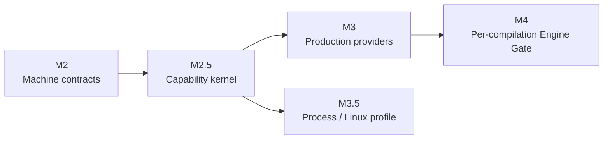

# Runtime 里程碑

[English](../en/concepts/milestones.md)

Holonomy 的 Runtime 路线按能力边界推进，而不是把所有平台功能塞进一次发布。里程碑编号保持稳定：M2 冻结机器合同，M2.5 建立安全能力内核，M3 再扩展生产 Provider；Process/Linux 与逐次 Engine Gate 分别独立推进。

## 路线图

| 里程碑 | 当前状态 | 已冻结或实现的边界                                                                                                                       | 不随该里程碑承诺                                                |
| ------ | -------- | ---------------------------------------------------------------------------------------------------------------------------------------- | --------------------------------------------------------------- |
| M2     | 完成     | SandboxPolicy v2、Context、Capability、CanonicalResource、Snapshot、Operation Registry、错误与共享 vectors                               | 生产 Provider、公开 Host SDK                                    |
| M2.5   | 完成     | 原子 Runtime 创建、统一 Broker/Koa Middleware/Provider authority、generation fencing，以及 Node/Desktop 与 Android 模拟器 `kernel-slice` | 完整 FS、完整 Device/System、Process、逐次 eval prompt          |
| M3     | 进行中   | 完整声明范围内的 FS、Device、System、Network 生产 Provider v1；Runtime Plugin 子轨已具备跨平台启动证据和 Node/Desktop watch              | Process/Linux 与逐次 Engine Gate                                |
| M3.5   | 完成     | macOS Node/Desktop 的 Stable Native profile；Node/Desktop 另有 Host 安装的 Experimental v86 profile 与正式 Runtime E2E                   | 所有 target 都必须提供 Process；Experimental 镜像资产随核心发布 |
| M4     | 未开始   | 每次字符串/Wasm 编译前的 Engine Gate、窄 Native Hook、Observer/source reader                                                             | 授权 UI 或 Grant 产品策略                                       |

## M2.5 的完成含义

M2.5 证明同一套不可绕过的调用链已经跨平台工作：

1. Host 在 Guest entry 前原子安装 Context、Policy、初始 Middleware、Provider bindings 与 generation。
2. 可授权调用统一经过 `Snapshot → CanonicalResource → Policy → system layer → Host Middleware → Provider authority → result validation`。
3. Node/Desktop 与 Android 模拟器均验证受控文件读写、Host System、`holo:device`、真实或 mock Network，以及同步、callback、Promise 错误语义。
4. 初始失败不执行 Guest entry；restart、stop、timeout 与迟到结果受 generation fence 约束。

这仍是刻意收窄的 [`kernel-slice`](./capability-runtime.md)。支持矩阵只声明真实通过的代表性 operation，不把 M2.5 写成完整生产 Provider。

## 下一步

M3 继续按 Provider 轨道推进；M3.5 的首个 Stable profile 已独立完成，其他 Backend 作为后续可选实现：

- Runtime Plugin：Node/Desktop 启动与 watch、Android 静态启动已落地；Android 动态 replacement 仍未承诺。
- FS：扩展附录 H 声明的目录、handle、watcher、原子写与 TOCTOU 边界。
- Device/System：实现各 target 的 required descriptor、事件与真实/合成/脱敏投影。
- Network：完成 redirect、响应 continuation、WebSocket 支持声明和诊断边界。
- Process：`process-profile-v1`、Backend Registry 与 `native.darwin-seatbelt-v1` 已完成 M3.5；Node/Desktop v86 已具备 Host 私有安装、正式 Runtime stdio/FUSE/HTTP E2E，但保持 Experimental；Android 仍只有 instrumentation，agentOS/WASIX 仍未注册。

M3.5 的完成不等待 M3 全部 Provider 汇合，也不会反向放宽 M3 的 Policy、Resource 或 Broker 边界。逐次 eval/Function/Wasm Gate 保持 M4 轨道。任何新增 Backend 的公开支持声明仍需对应平台真实 E2E、双语文档和独立审阅。
