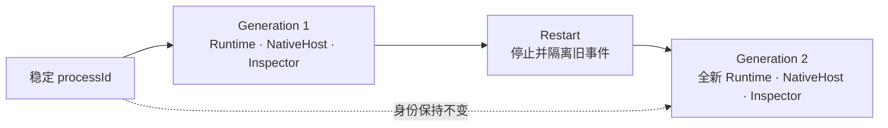
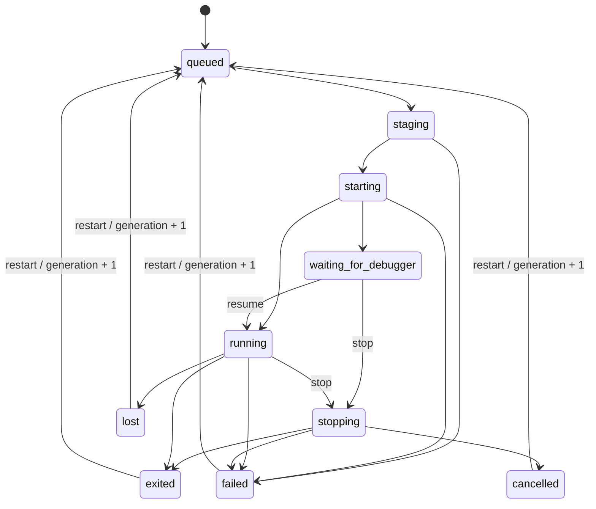

# Process 与 Generation

[English](../en/concepts/process-and-generation.md)

`processId` 表示用户管理的稳定逻辑进程，`generation` 表示该进程当前的具体 Runtime 实例。

Restart 保留入口、模块快照、SandboxPolicy 和 `processId`，递增 generation，并重新创建目标 Adapter 的执行资源。旧 generation 的输出、完成事件、stop 请求和 Inspector lease 不能影响新 generation。

进程状态为：

`lost` 表示 Service 无法再证明目标资源仍可控制，例如 Android 设备离线。终态进程的 Restart 先以新 generation 回到 `queued`，再重新进入 staging。需要清理的 Android 资源会保留 `cleanupPending`，待设备恢复后继续核验和清理。
