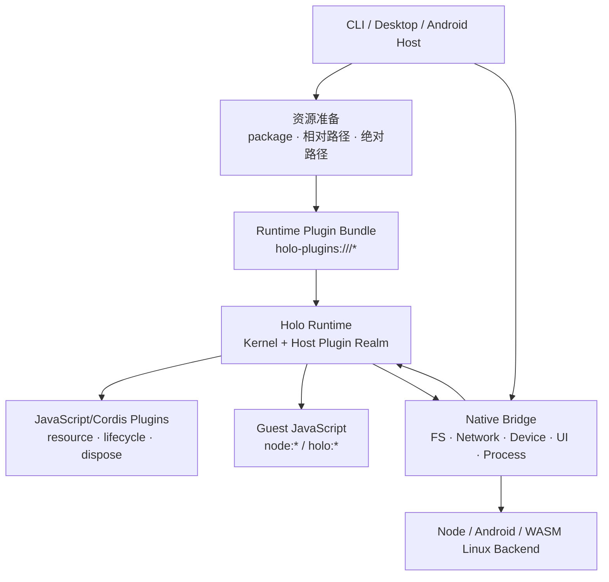

# Runtime 插件与热更新

[English](../en/concepts/runtime-plugins.md)

> Runtime 插件的资源与生命周期基础已作为 M3 子轨落地。Node/Desktop 支持启动装载、Capability Middleware graph/drain 和 `--watch`；Android 支持独立 Host realm 中的启动时静态同步 Bundle 与同步 Capability interception，但不支持动态 replacement。真实支持状态仍以[支持矩阵](../capabilities/support-matrix.md)为准。

Holonomy 只采用一种插件模型：Host 准入的 JavaScript/Cordis 插件。所有平台使用同一份 `holo-plugins:///*` Bundle 合同，但执行能力可以是平台子集：Node/Desktop 使用完整 generation-owned Cordis App；Android v1 使用与 Guest 隔离的 Host V8 realm 和同步 Cordis Context。

## 总体关系



Native Host 不实现另一套插件 API。可信启动侧只加载资源字节并生成 Bundle，Native Host 提供 Resource Manifest、Native Bridge 和 Runtime 生命周期。Service 校验启动或更新事务，Runtime 再把插件安装到 generation 自己的 Host plugin realm；Guest 无法取得该 realm 的 global、intrinsics 或 Cordis Context。

## 代码角色

Runtime 内部分为 Kernel/Cordis App、Capability 模块和可选基础插件；平台 Adapter 只提供 Provider 与 Native Bridge。CLI 或 Native Host 准备插件资源，Service 只负责准入、revision 与进程生命周期，不读取远程调用方的本地文件路径。

插件可以依赖 Runtime 提供的 Context 和自己 Bundle 内的相对模块；Runtime 不反向依赖某一个具体插件。Node/Desktop 已提供 `ctx.holo.intercept()`，并把插件 graph revision、在途调用 drain 和 dispose 接到 Capability Broker。`@holonomyjs/plugin-permission` 与 `@holonomyjs/plugin-audit` 提供基础 factory：Holonomy 拥有协议与安全默认值，应用注入 permission decider 和 audit sink。Android v1 提供同名同步拦截 service；异步 decider/sink 仍稳定拒绝。

插件 npm 包通过 `package.json.holo` 声明统一入口：

```json
{
  "name": "@company/holo-permission",
  "holo": {
    "kind": "runtime-plugin",
    "apiVersion": 1,
    "entry": "./dist/index.mjs",
    "configSchema": "./dist/config.schema.json"
  }
}
```

入口必须导出 Runtime Cordis App 可安装的 JavaScript plugin。`enabled`、`export` 和 `config` 的缺省值分别是 `true`、`default` 和 `{}`；可选 `integrity` 用于锁定预期 Bundle 摘要。

## 插件资源

Runtime 内的插件 URL 使用独立 scheme：

```text
holo-plugins:///<plugin-instance-id>/<relative-path>
```

它与不可变的 `holo:///runtime/*` 内部资产分离。Bundle 包含入口、所有文件、配置和 integrity；Runtime 看不到 npm、pnpm、symlink 或 Host 原生路径。

CLI 配置格式是：

```json
{
  "plugins": [
    {
      "id": "permission",
      "use": "@company/holo-permission",
      "config": { "interactive": true }
    },
    {
      "id": "audit",
      "use": "./plugins/local-audit.mjs"
    },
    {
      "id": "security",
      "use": "/opt/company/holo-plugins/security",
      "enabled": true
    }
  ]
}
```

- package 从配置所属 workspace 解析；
- 以 `./` 或 `../` 开头的相对路径以 `holo.config.json` 所在目录为基准；
- 绝对路径需要 Host policy 明确允许；
- 其他字符串按 package 解析，v1 不接受 `file:` URL；
- `run` 不会在启动或 watch 时自动联网安装插件。

CLI 从配置所属 workspace 解析、校验并构建 Bundle，再把无 Host 路径的不可变资源图提交给 Service。Android Host 可以从 APK assets 或自己管理的存储准备同样的 Bundle；Service 和 Runtime 不会反向读取调用方文件系统。

## `watch` 模式

Node/Desktop 命令为：

```bash
holonomy run app.mjs --config holo.config.json --watch
```

CLI watcher 每次看到配置文件变化都会重新读取完整文件。只有 JSON、配置 Schema、插件 Schema、来源和 integrity 全部有效，候选 Bundle 才会通过 Service 的 revision CAS 提交给 Runtime。

diff 使用唯一 `plugins[].id` 和数组顺序：

- 新增 ID：装载新插件；
- 删除或禁用：卸载对应 Cordis scope；
- 来源、export、config 或 integrity 改变：先装载替代实例，再卸载旧实例；
- 顺序变化：发布新的有序 Capability Middleware graph；新调用使用新 revision，旧调用继续使用自己的冻结 snapshot；
- 没变化：不重复装卸。

更新采用 last-known-good 语义。无效 JSON、重复 ID、Schema 错误或插件加载失败只产生诊断，不会拆掉正在工作的插件图。Runtime replacement 成功后 Service 才发布新 revision；新 Capability invocation 使用新 graph，已开始的 invocation 保留旧 snapshot，旧 revision drain 后才 dispose。

v1 只承诺配置变化和重新解析后的 Bundle diff，不承诺任意源码文件的 HMR。删除配置文件也不会被解释为空插件列表；要卸载全部插件，必须写入合法的 `"plugins": []`。

Android/Javet 不使用运行时动态 import。Host 在启动前把已准入 Bundle 合成为只读静态模块 manifest，并在独立 Host V8 realm 中同步安装；插件 global 不会出现在 Guest 中。Android v1 会拒绝返回 Promise 的异步插件初始化与 async Middleware，失败时 Guest entry 不执行。静态同步插件可以拦截 Capability 调用；动态 graph replacement 留待后续版本，CLI 会稳定拒绝 Android `--watch`。

## 不可越过的边界

- System Policy、Snapshot、Authority 和 Generation fencing 不属于可卸载插件。
- Guest 无法取得 Cordis Context，也不能安装、排序或卸载 Host 插件。
- Permission/Audit 由 Holonomy 提供协议和基础 factory，应用决定弹窗、允许一次/长期允许、持久化与审计目的地；Android v1 只能使用其同步 decider/sink 子集。
- Node/Desktop 插件卸载会清理由 Cordis Context/effect 登记的资源，并等待旧 graph invocation drain；Android v1 只在 generation 关闭时整体销毁静态 Host plugin realm。
