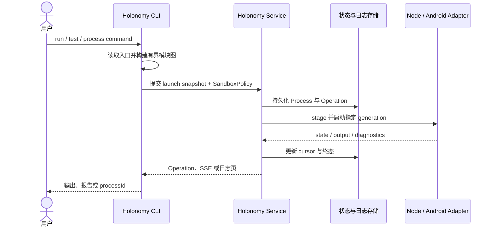

# Service 与 CLI

[English](../en/concepts/service-and-cli.md)

CLI 是编译和交互入口，Service 是长期控制面。

CLI 负责读取命令、发现入口文件、构建有界模块图、生成 test wrapper 和呈现结果。Service 负责设备、进程、日志、fixture、ADB lease、Network Rules、Inspector lease、恢复和保留策略。

默认 `--openapi auto` 会自动启动或复用当前用户的 loopback Service。显式远程 Service 不自动回退到本地或直接 ADB；非 loopback 必须使用 HTTPS 和 Token。

这种单 owner 模型避免多个 CLI 互相删除 forward、reverse 或会话文件，也让后台进程在创建它的 CLI 退出后继续被管理。
