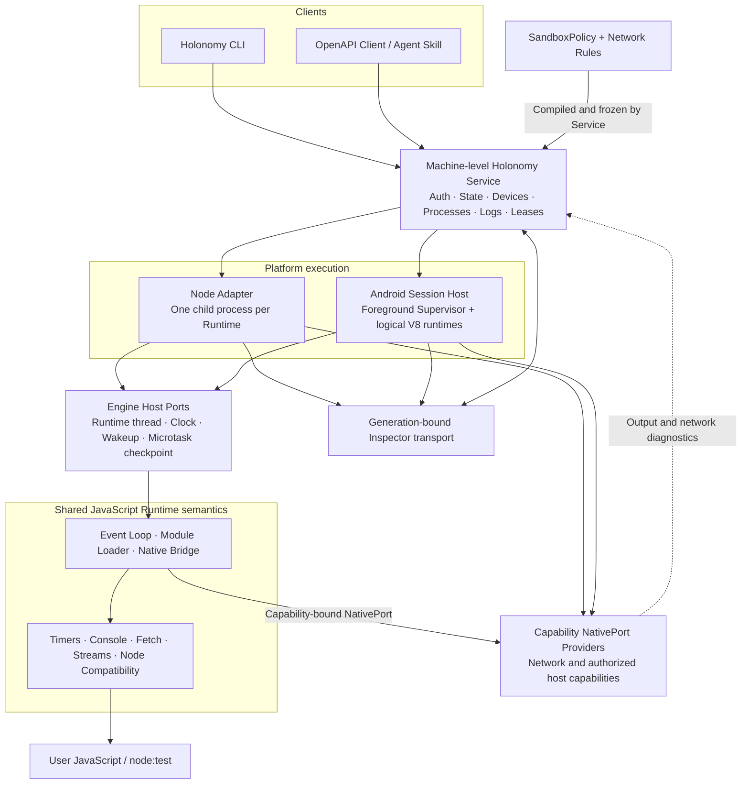
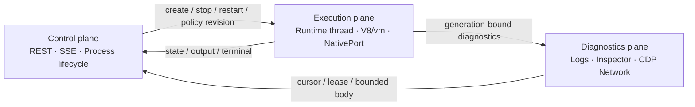

# System architecture

[简体中文](../../concepts/architecture.md)

Holonomy separates user interaction, durable resource management, platform execution, and public JavaScript semantics into four layers. The Service is the single long-lived resource owner; Node and Android adapters implement only their platform execution boundary.

The CLI compiles local entries and renders results without owning background resources. The Service owns Node, Android, ADB, AVD, Process, Network Rules, and Inspector leases. The shared Runtime owns public JavaScript behavior. Engine Host Ports provide execution primitives such as the runtime thread, clock, and wakeups; Capability NativePort Providers expose explicitly authorized host capabilities; Inspector uses a separate generation-bound diagnostics transport.

## Control, execution, and diagnostics

All three planes share `processId + generation` identity. Commands, output, and Inspector connections from an old generation cannot affect a new Runtime.
