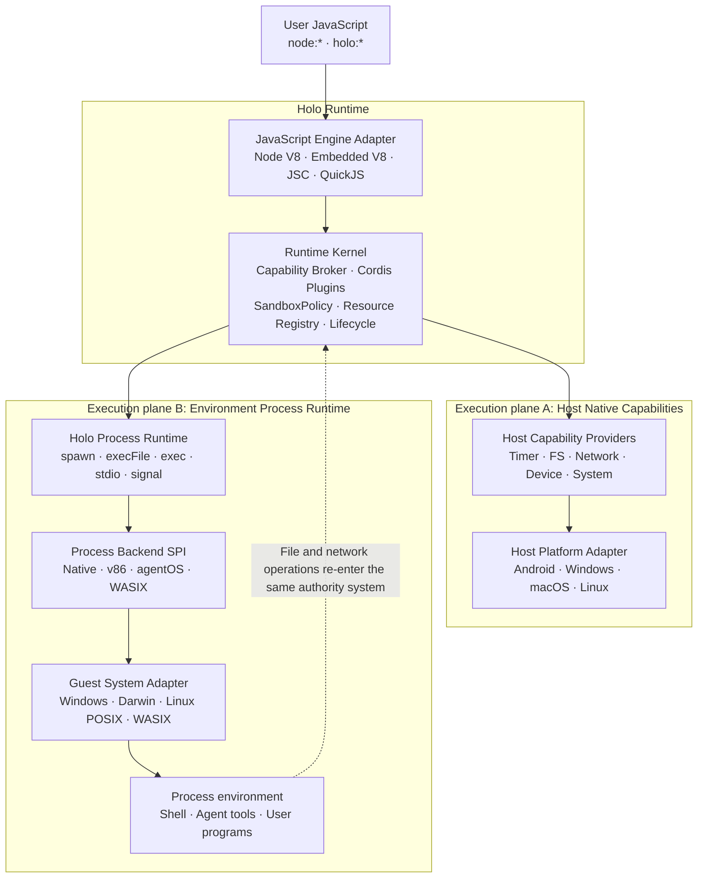
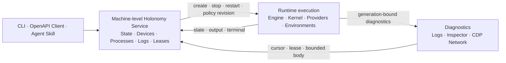

# System architecture

[简体中文](../../concepts/architecture.md)

Holonomy connects two execution planes through one shared Runtime Kernel. Ordinary Host capabilities are implemented directly by platform Providers, while process capabilities that require an operating-system environment are delegated to a pluggable Environment Backend. Both paths share the same SandboxPolicy, Cordis plugin chain, Capability Broker, Resource Registry, and generation lifecycle.



`Host Native Capability Providers` own timers, files, networking, device access, and system information. `Process Backend SPI` abstracts process environments only; it is not a second general-purpose Native Bridge. File and network operations from Linux must re-enter the Kernel with environment, process, and resource identity, so a virtual machine cannot bypass Host Policy.

## Workspace code boundaries

Real implementations are split into workspace packages by responsibility:

```text
packages/runtime/                 Runtime Kernel, Cordis App, and generic JS Runtime leaves
packages/capabilities/fs/         node:fs and file-resource contracts
packages/capabilities/device/     holo:device and device-event contracts
packages/capabilities/system/     node:os / node:process Host projection contracts
packages/capabilities/network/    Fetch, network invocation, and Linux network bridge
packages/capabilities/process/    node:child_process and Process resource protocol
backends/                         Environment Backend assets such as v86, agentOS, and WASIX
adapters/                         Node, Android, Desktop Host/Engine/Provider implementations
```

The root `src/` tree now contains compatibility exports for pre-split public paths only; it no longer owns implementations. New Runtime logic belongs in `packages/runtime`, Capability logic belongs in the corresponding `packages/capabilities/*`, and Host I/O must stay out of these platform-neutral packages.

## Four independent composition axes

Platform, JavaScript engine, Process Backend, and in-environment system semantics are not interchangeable:

| Axis                | Responsibility                                                          | Examples                            |
| ------------------- | ----------------------------------------------------------------------- | ----------------------------------- |
| Host Platform       | Where the Runtime runs and how it obtains native resources              | Android, Windows, macOS, Linux      |
| JavaScript Engine   | Realms, module execution, microtasks, Inspector, and Engine Gate        | Node V8, Embedded V8, JSC, QuickJS  |
| Environment Backend | Where and how process environments are created                          | Native, v86, agentOS, WASIX         |
| Guest System        | System semantics such as paths, argv, shell, signals, and process trees | Windows, Darwin, Linux POSIX, WASIX |

Desktop is therefore a product form factor, not a synonym for Node or V8. A Desktop Host may use Embedded V8, JSC, or QuickJS and may select a Native, v86, or other Backend. Every concrete combination needs its own descriptor, adapters, and E2E evidence; it cannot inherit another combination's support claim.

Windows likewise needs an explicit System Adapter covering `CreateProcess` quoting, `cmd.exe`, drive and UNC paths, case-insensitive environment keys, HANDLE/pipe behavior, Job Objects, signals, and error translation. Platform differences belong in Host/System Adapters rather than the public `node:*` facade or the v86 Driver.

## Control plane and lifecycle



The CLI only compiles entries and renders results; the Service owns durable resources. Control, execution, and diagnostics share `processId + generation`, so requests, resources, events, and Inspector connections from an old generation cannot affect a new Runtime.
