# Secure capability kernel

[简体中文](../../concepts/capability-runtime.md)

Holonomy's secure capability kernel separates Runtime creation, hard permission ceilings, host interception, and real platform execution. The Filesystem, Device, System, Network, and secure Runtime Plugin graph surfaces in `provider-v1` have completed M3 platform acceptance; the matrix below still defines the exact supported subset.

## Invocation pipeline

```mermaid
flowchart LR
  host["Trusted Host"]
  service["Service admission<br/>Context · Policy · Middleware · Provider bindings"]
  runtime["Generation-bound RuntimeCreationSpec"]
  guest["Guest<br/>node:* / holo:* facade"]
  snapshot["Argument snapshot + CanonicalResource"]
  policy["SandboxPolicy v2<br/>non-amplifiable hard ceiling"]
  system["System layer"]
  middleware["Host Koa Middleware"]
  authority["Provider authority"]
  provider["Node/Desktop or Android Provider"]
  result["Result validation + Guest error translation"]

  host --> service --> runtime --> guest
  guest --> snapshot --> policy --> system --> middleware --> authority --> provider --> result --> guest
```



Each facade invocation uses one frozen argument snapshot and resource identity. Middleware may deny, short-circuit, or continue, but cannot enlarge the Policy. The Provider still validates its minimum authority immediately before real execution. Network admission covers the initial request and every redirect hop. Response metadata/body/clone re-enter Policy, quota, and Provider as `systemOnly` continuations through generation-bound resource tokens without re-running Host business authorization plugins.

## Atomic startup and restart

```mermaid
sequenceDiagram
  participant Host as Host / Service
  participant Adapter as Platform Adapter
  participant Kernel as Capability Kernel
  participant Guest as Guest entry

  Host->>Adapter: RuntimeCreationSpec + generation N
  Adapter->>Kernel: Install Context, Policy, initial Middleware, Provider bindings
  alt initial admission fails
    Kernel-->>Adapter: Stable failure
    Note over Guest: entry does not run; zero side effects
  else admission succeeds
    Kernel-->>Adapter: generation N ready
    Adapter->>Guest: Evaluate entry
  end
  Host->>Adapter: restart as generation N+1
  Adapter->>Kernel: Install new snapshot and invalidate old references
  Note over Kernel,Guest: N facades, tokens, and late results cannot affect N+1
```

The Host supplies Runtime Context during creation and produces separate Host, Guest, and Inspector projections. Guest code can read only the Guest projection through `holo:runtime`; it cannot self-declare identity or access Host-private fields.

## Current `provider-v1`

| Scenario                                          | Node/Desktop                                                                            | Android emulator                                                            |
| ------------------------------------------------- | --------------------------------------------------------------------------------------- | --------------------------------------------------------------------------- |
| Atomic install and initial failure with `entry=0` | Verified                                                                                | Verified                                                                    |
| `holo:runtime` Guest Context                      | Verified                                                                                | Verified                                                                    |
| Sandbox filesystem v1                             | One Guest conformance covers Appendix H plus resource/overflow negatives                | The same conformance plus resource/overflow/Abort/quota negatives           |
| Host System Projection                            | Declared real/synthetic/redacted/unavailable fields                                     | Declared real/synthetic/redacted/unavailable fields                         |
| Device Provider                                   | The current adapter publishes the Headless Node descriptor, not a Desktop event profile | Android-required reads plus real platform change, revision/resync, fencing  |
| Network                                           | Real/mock, redirect, Response, DNS/private-IP, Rules, and diagnostics                   | Mock continuation, private-DNS denial, Response, Rules, cancel, diagnostics |
| Restart generation fencing                        | Verified                                                                                | Verified                                                                    |

The filesystem exposes only Host-configured `holo-fs://` virtual roots and never native Host paths. Runtime Plugins can be startup-loaded from `holo-plugins:///*` Bundles. Node/Desktop connects an isolated Host realm, Capability Middleware graph/drain, and Permission/Audit foundation factories to the Broker. Android v1 uses a static synchronous plugin subset in a separate Host V8 realm and connects synchronous Capability interception to the same Broker; live replacement remains unavailable.

## Outside the current claim

- Other `node:fs` APIs not declared by Appendix H, or arbitrary Host paths.
- Dynamic Android Runtime Plugin replacement; Android supports startup-time static Bundles only.
- WebSocket client transport; the current global is a fixed, detectable unsupported facade.
- POSIX filesystem access outside v86 `/workspace`, physical Android, 64-bit/multicore, and true VM snapshot/restore. Experimental v1 now covers controlled TCP/UDP/DNS, Host Device/System projection, and Android descendant exec gating.
- Per-eval/Function prompts or the complete Observer.
- Treating emulator evidence as physical Android device acceptance.

See the [support matrix](../capabilities/support-matrix.md) for exact status and the [SandboxPolicy reference](../reference/sandbox-policy.md) for the policy boundary.
