# Secure capability kernel

[简体中文](../../concepts/capability-runtime.md)

Holonomy's secure capability kernel separates Runtime creation, hard permission ceilings, host interception, and real platform execution. The currently exposed `kernel-slice` verifies that Node/Desktop and the Android emulator share one security pipeline; it is not a claim that complete production providers are finished.

## Invocation pipeline

```mermaid
flowchart LR
  host["Trusted Host"]
  service["Service admission<br/>Context · Policy · Middleware · Provider bindings"]
  runtime["Generation-bound RuntimeCreationSpec"]
  guest["Guest<br/>node:* / holo:* facade"]
  snapshot["Argument snapshot + CanonicalResource"]
  policy["SandboxPolicy v2<br/>non-amplifiable hard ceiling"]
  system["System layer"]
  middleware["Host Koa Middleware"]
  authority["Provider authority"]
  provider["Node/Desktop or Android Provider"]
  result["Result validation + Guest error translation"]

  host --> service --> runtime --> guest
  guest --> snapshot --> policy --> system --> middleware --> authority --> provider --> result --> guest
```



Each currently exposed facade invocation uses one frozen argument snapshot and resource identity. Middleware may deny, short-circuit, or continue, but cannot enlarge the Policy. The Provider still validates its minimum authority immediately before real execution. In the current `kernel-slice`, the Network Broker admits only the first logical Fetch request; redirects and Response continuations remain transport-owned, and the Capability Network policy must match that transport policy field for field. Re-entering the Broker for those `systemOnly` continuations belongs to M3.

## Atomic startup and restart

```mermaid
sequenceDiagram
  participant Host as Host / Service
  participant Adapter as Platform Adapter
  participant Kernel as Capability Kernel
  participant Guest as Guest entry

  Host->>Adapter: RuntimeCreationSpec + generation N
  Adapter->>Kernel: Install Context, Policy, initial Middleware, Provider bindings
  alt initial admission fails
    Kernel-->>Adapter: Stable failure
    Note over Guest: entry does not run; zero side effects
  else admission succeeds
    Kernel-->>Adapter: generation N ready
    Adapter->>Guest: Evaluate entry
  end
  Host->>Adapter: restart as generation N+1
  Adapter->>Kernel: Install new snapshot and invalidate old references
  Note over Kernel,Guest: N facades, tokens, and late results cannot affect N+1
```

The Host supplies Runtime Context during creation and produces separate Host, Guest, and Inspector projections. Guest code can read only the Guest projection through `holo:runtime`; it cannot self-declare identity or access Host-private fields.

## Current `kernel-slice`

| Scenario                                          | Node/Desktop                                  | Android emulator                     |
| ------------------------------------------------- | --------------------------------------------- | ------------------------------------ |
| Atomic install and initial failure with `entry=0` | Verified                                      | Verified                             |
| `holo:runtime` Guest Context                      | Verified                                      | Verified                             |
| Controlled workspace file read/write              | `node:fs` sync/callback/promise               | `node:fs` sync/callback/promise      |
| Host System                                       | `node:os` `arch()`                            | `node:os` `arch()`                   |
| Device                                            | `holo:device` form factor                     | form factor and power                |
| Network                                           | real and mock first requests share the Broker | mock first requests share the Broker |
| Restart generation fencing                        | Verified                                      | Verified                             |

The filesystem slice exposes only one Host-configured `holo-fs://workspace/` virtual root with `read`/`write` rights and strict limits. Native Host paths never enter the public surface. The current slice also accepts only bounded built-in Middleware descriptors; a public Host SDK for arbitrary UI or permission logic is not published yet.

## Outside the current claim

- The complete `node:fs` v1 export, watcher, directory, and handle surface.
- All Host System fields or a target-compliant `holo:device` Provider.
- A public arbitrary Host Middleware registration SDK or permission UI toolkit.
- The target [Cordis Runtime Plugin, `holo-plugins:///` Bundle, and CLI watch architecture](./runtime-plugins.md).
- Broker re-entry for `systemOnly` continuations such as redirects and Response metadata/body.
- `node:child_process`, per-compilation eval/Function prompts, or the complete Observer.
- Treating emulator evidence as physical Android device acceptance.

See the [support matrix](../capabilities/support-matrix.md) for exact status and the [SandboxPolicy reference](../reference/sandbox-policy.md) for the policy boundary.
