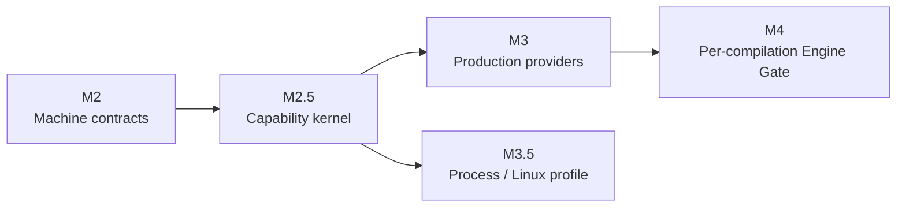

# Runtime milestones

[简体中文](../../concepts/milestones.md)

Holonomy advances the Runtime by capability boundary instead of placing every platform feature into one release. The numbering remains stable: M2 freezes machine contracts, M2.5 establishes the secure capability kernel, and M3 expands production Providers. Process/Linux and per-compilation Engine Gate work proceed as separate tracks.

## Roadmap

| Milestone | Current status | Boundary frozen or implemented                                                                                                                                           | Not promised by this milestone                                          |
| --------- | -------------- | ------------------------------------------------------------------------------------------------------------------------------------------------------------------------ | ----------------------------------------------------------------------- |
| M2        | Complete       | SandboxPolicy v2, Context, Capability, CanonicalResource, Snapshot, Operation Registry, errors, and shared vectors                                                       | Production Providers or a public Host SDK                               |
| M2.5      | Complete       | Atomic Runtime creation, unified Broker/Koa Middleware/Provider authority, generation fencing, and the Node/Desktop plus Android-emulator `kernel-slice`                 | Complete FS, complete Device/System, Process, or per-eval prompts       |
| M3        | In progress    | Production Provider v1 for the declared FS, Device, System, and Network surface; the Runtime Plugin sub-track has cross-platform startup evidence and Node/Desktop watch | Process/Linux or the per-compilation Engine Gate                        |
| M3.5      | Complete       | Stable Native profile on macOS Node/Desktop, plus a Host-installed Experimental v86 profile with production-Runtime E2E on Node/Desktop                                  | Requiring Process on every target or shipping Experimental image assets |
| M4        | Not started    | Engine Gate before each string/Wasm compilation, narrow Native Hook, Observer, and source reader                                                                         | Permission UI or product Grant policy                                   |

## What M2.5 completion means

M2.5 proves that one non-bypassable invocation pipeline works across platforms:

1. The Host atomically installs Context, Policy, initial Middleware, Provider bindings, and generation before Guest entry.
2. Authorizable calls share `Snapshot → CanonicalResource → Policy → system layer → Host Middleware → Provider authority → result validation`.
3. Node/Desktop and the Android emulator verify controlled file reads and writes, Host System, `holo:device`, real or mock Network, and sync, callback, and Promise error semantics.
4. Initial failure runs no Guest entry; restart, stop, timeout, and late results remain generation-fenced.

This is still an intentionally narrow [`kernel-slice`](./capability-runtime.md). The support matrix declares only operations backed by real evidence and does not describe M2.5 as a complete production Provider.

## Next

M3 continues along its Provider tracks. M3.5's first Stable profile is independently complete, while other Backends remain optional follow-up implementations:

- Runtime Plugin: Node/Desktop startup and watch plus Android static startup are implemented; Android dynamic replacement is not promised.
- FS: expand the Appendix H directory, handle, watcher, atomic-write, and TOCTOU boundaries.
- Device/System: implement each target's required descriptor, events, and real/synthetic/redacted projections.
- Network: complete redirects, response continuations, WebSocket support declarations, and diagnostics boundaries.
- Process: `process-profile-v1`, the Backend Registry, and `native.darwin-seatbelt-v1` complete M3.5. Node/Desktop v86 now has private Host installation plus production-Runtime stdio/FUSE/HTTP E2E but remains Experimental. Android remains instrumentation-only, and agentOS/WASIX are not registered.

M3.5 completion does not wait for every M3 Provider to converge and does not loosen M3 Policy, Resource, or Broker boundaries. Per-eval/Function/Wasm gating remains M4. Every additional Backend support claim still requires real platform E2E evidence, bilingual documentation, and independent review.
