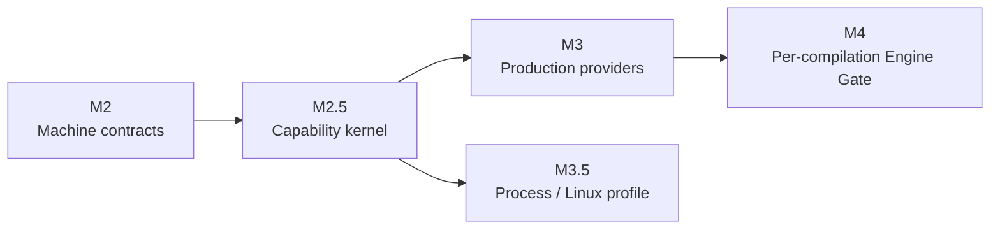

# Runtime milestones

[简体中文](../../concepts/milestones.md)

Holonomy advances the Runtime by capability boundary instead of placing every platform feature into one release. The numbering remains stable: M2 freezes machine contracts, M2.5 establishes the secure capability kernel, and M3 expands production Providers. Process/Linux and per-compilation Engine Gate work proceed as separate tracks.

## Roadmap

| Milestone | Current status | Boundary frozen or implemented                                                                                                                           | Not promised by this milestone                                          |
| --------- | -------------- | -------------------------------------------------------------------------------------------------------------------------------------------------------- | ----------------------------------------------------------------------- |
| M2        | Complete       | SandboxPolicy v2, Context, Capability, CanonicalResource, Snapshot, Operation Registry, errors, and shared vectors                                       | Production Providers or a public Host SDK                               |
| M2.5      | Complete       | Atomic Runtime creation, unified Broker/Koa Middleware/Provider authority, generation fencing, and the Node/Desktop plus Android-emulator `kernel-slice` | Complete FS, complete Device/System, Process, or per-eval prompts       |
| M3        | Complete       | Production Provider v1 for the declared FS, Device, System, and Network surfaces, plus the secure Runtime Plugin graph and Node/Desktop watch            | Process/Linux or the per-compilation Engine Gate                        |
| M3.5      | Complete       | Stable Native profile on macOS Node/Desktop, plus Experimental v86 profiles and Runtime E2E on Node/Desktop and the optional Android module              | Requiring Process on every target or shipping Experimental image assets |
| M4        | Not started    | Engine Gate before each string/Wasm compilation, narrow Native Hook, Observer, and source reader                                                         | Permission UI or product Grant policy                                   |

## What M2.5 completion means

M2.5 proves that one non-bypassable invocation pipeline works across platforms:

1. The Host atomically installs Context, Policy, initial Middleware, Provider bindings, and generation before Guest entry.
2. Authorizable calls share `Snapshot → CanonicalResource → Policy → system layer → Host Middleware → Provider authority → result validation`.
3. Node/Desktop and the Android emulator verify controlled file reads and writes, Host System, `holo:device`, real or mock Network, and sync, callback, and Promise error semantics.
4. Initial failure runs no Guest entry; restart, stop, timeout, and late results remain generation-fenced.

M2.5 originally delivered the intentionally narrow `kernel-slice`. Later M3 Provider tracks extend that same kernel into the current [`provider-v1`](./capability-runtime.md) without rewriting the earlier milestone boundary.

## Next

M3 and M3.5's first Stable profile are complete. Further work stays in explicit optional increments and does not retroactively widen the released boundary:

- Runtime Plugin: Node/Desktop startup and watch plus Android static startup are implemented; Android dynamic replacement is not promised.
- FS: Appendix H directory, handle, watcher, atomic-write, quota, Abort, and TOCTOU boundaries are complete.
- Device/System: published-target required descriptors, real Android events, and real/synthetic/redacted/unavailable projections are complete. The current Node/Desktop adapter publishes the Headless Node Device descriptor and does not claim a Desktop event profile.
- Network: redirects, response continuations, the fixed WebSocket unsupported declaration, and diagnostics boundaries are complete.
- Platform/Engine: keep Host Platform, JavaScript Engine, Environment Backend, and Guest System as independent axes. A Windows System Adapter or non-V8 Desktop Engine enters the support matrix only after its own E2E evidence exists.
- Process: `process-profile-v1`, the Backend Registry, and `native.darwin-seatbelt-v1` complete M3.5. Node/Desktop v86 has private Host installation, while Android v86 has an optional production-AAR integration. Both have production-Runtime E2E evidence and remain Experimental. Future agentOS/WASIX integrations reuse the Environment Host Runtime and Guest System Adapter; neither is registered yet.

M3 converges through five internal delivery checkpoints:

| Checkpoint                   | Status      | Completion boundary                                                                                                                                                                     |
| ---------------------------- | ----------- | --------------------------------------------------------------------------------------------------------------------------------------------------------------------------------------- |
| M3-R Runtime Plugin          | Complete v1 | Node/Desktop Host-realm graph/drain, Permission/Audit factories, and real CLI watch; Android isolated Host-realm static synchronous Capability bridge                                   |
| M3-F Filesystem              | Complete v1 | Shared Node/Desktop and Android Guest conformance covers H surface, watch/overflow, quotas, Abort, and atomic behavior; platform restart E2E covers old-generation resources and TOCTOU |
| M3-D Device/System           | Complete v1 | Published-target descriptors, real Android platform change with revision/resync/fencing, and all-System projection no-leakage E2E                                                       |
| M3-N Network                 | Complete v1 | Every redirect hop, Response body/clone, DNS resolution, real/mock path, and diagnostics reader use Broker continuations                                                                |
| M3-X Convergence and release | Complete v1 | system-only/resource tokens, facade compatibility, cross-platform E2E, real workspace tarball installation, bilingual docs, OpenAPI, Skills, and support matrix                         |

M3.5 delivers Experimental v86 v1 through the following checkpoints. The first three are closed; the last checkpoint governs promotion beyond Experimental and does not block current M3.5:

1. **M3.5-U HoloUV foundation (complete v1)**: `@holonomyjs/holouv` owns the shared Environment Runtime, generation fencing, process/stdio resources, and asynchronous terminal behavior. `/sbin/holo-uvd` implements the required process, stream, FS, network, handle, request, and loop semantics over a versioned wire protocol without passing `uv_*` memory structures. Public JavaScript remains Node-compatible, while Host OS and Guest System differences stay in adapters.
2. **M3.5-I Linux images (complete v1)**: the Host can select digest-bound `minimal`, `base`, `agent`, or strict `custom` profiles. `base` contains BusyBox, `/bin/sh`, and `cat`; `agent` adds `curl`/CA, `git`, `ssh`, `jq`, `nc`, and `timeout`. Outputs carry digests, an SPDX SBOM, locked dependencies, and an executable allowlist. Runtime JavaScript cannot choose images, startup never installs tools from the network, and Linux assets remain optional Host installations rather than core-package payloads.
3. **M3.5-B v86 capability bridges (complete Experimental v1)**: Node/Desktop and the Android emulator prove the `/workspace` FUSE surface, TCP/UDP/DNS, Host Device/System projections, and descendant pre-execution admission through the standard `node:child_process` facade. The Host channel preserves environment, Linux PID/PPID, executable, and generation. `execve`, absolute `execveat(AT_FDCWD, flags=0)`, and PATH-resolved absolute targets re-enter the same Broker; relative dirfd, `AT_EMPTY_PATH`, unknown, or mutable targets fail closed. The gate deadline is Host-profile-only, and one authorized `/workspace` mount prevents executable shadowing.
4. **M3.5-P support promotion (evidence boundary explicit)**: the current profile remains x86-32, single-core, and Experimental. The current `agent` asset set is about 37.9 MiB raw with about 2.9 MiB of compressed debug-AAR growth; evidence also covers digest verification, startup cancellation, generation restart, failure cleanup, and resource limits. Physical Android, 64-bit/multicore, and true VM snapshot/restore remain future promotion conditions and are not inferred from emulator results or v86 initial-state boot support.

The active scope contains only Stable Native Darwin and Experimental v86. agentOS, WASIX, Windows Process/System adapters, and non-V8 Desktop engines retain research records or extension points only and are not scheduled M3/M3.5 work. Reactivation requires a new design decision and independent platform evidence.

## Work ownership map

| Work item                                                                                  | Milestone            | Current status                 | Completion boundary                                                                                              |
| ------------------------------------------------------------------------------------------ | -------------------- | ------------------------------ | ---------------------------------------------------------------------------------------------------------------- |
| Ordinary Runtime filesystem, Device, and System                                            | M3-F / M3-D          | Complete v1                    | Production Providers, published-target descriptors, real events, and no default Host-information leakage         |
| JavaScript `fetch()`, redirects, and Response continuations                                | M3-N                 | Complete v1                    | Cross-platform real/mock, per-hop admission, DNS/private-IP, body/clone/cancel, and Rules-revision E2E           |
| Shared process, stream, handle, loop, and OS adaptation semantics                          | M3.5-U               | Complete v1                    | HoloUV, the versioned `holo-uvd` protocol, and Host OS/Guest System Adapter compatibility and difference vectors |
| Linux images and tools such as `shell`, `cat`, and `curl`                                  | M3.5-I               | Complete v1                    | Reproducible `minimal/base/agent/custom` images, digests, SBOMs, allowlists, and real tool E2E                   |
| Linux filesystem, TCP/UDP/DNS, Device/System injection, and descendant execution admission | M3.5-B               | Complete Experimental v1       | Re-enter the same Broker with environment, PID/PPID, and executable attribution plus TOCTOU/fencing coverage     |
| v86 support-level promotion                                                                | M3.5-P               | Remains Experimental           | Physical device, 64-bit/multicore, and true snapshot/restore are required before promotion                       |
| agentOS, WASIX, Windows, and non-V8 Desktop                                                | No current milestone | Research/extension points only | Schedule only after a new decision, installed implementation, and independent platform E2E                       |

The work is assigned by capability rather than duplicated for each Backend:

- Ordinary Runtime FS, Network, and Device/System belong to M3-F, M3-N, and M3-D. Extending the same authority into a Linux environment belongs to M3.5-B.
- HoloUV belongs to M3.5-U and unifies environment lifecycle, handles/requests, stdio, process trees, and asynchronous terminals. It is not a temporary Supervisor dedicated only to `spawn()`.
- `shell`, `cat`, and `curl` are image software owned by M3.5-I. The `base` and `agent` images now pass real-tool E2E, but remain optional Host assets rather than default core-package installations.
- `curl`, `git`, and other Linux programs use the M3.5-B Process Network Bridge with environment, PID/PPID, and executable attribution. JavaScript `fetch()` remains under M3-N. Both share the Network Policy owner but are distinct operations.
- M3-D creates the authoritative, per-field configurable Host Device/System projection. M3.5-B transports only the fields, modes, precision, and events selected by the Host; it never infers Host information from Linux `/proc` or virtual hardware.
- 64-bit, multicore, true snapshot/recovery, physical devices, and promotion beyond Experimental belong to M3.5-P. They are higher-support-level conditions and do not retroactively block the closed Experimental v1.

M3.5 completion does not wait for every M3 Provider to converge and does not loosen M3 Policy, Resource, or Broker boundaries. Per-eval/Function/Wasm gating remains M4. Every additional Backend support claim still requires real platform E2E evidence, bilingual documentation, and independent review.
