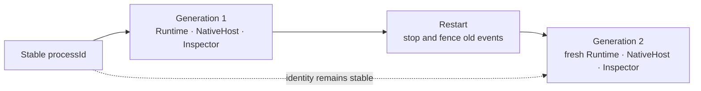
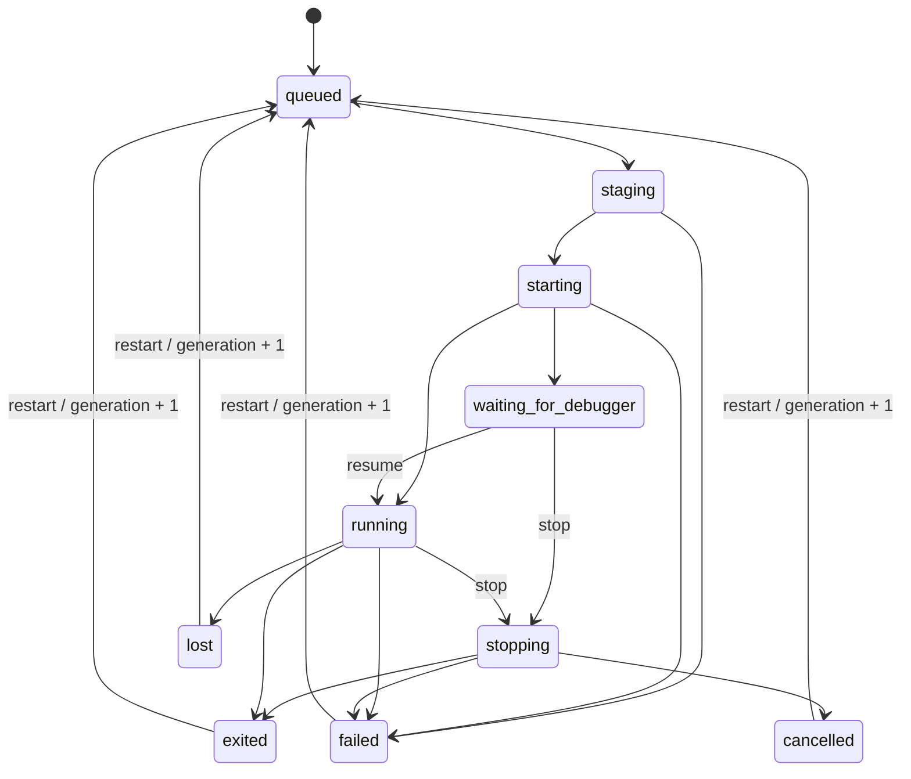

# Process and Generation

[简体中文](../../concepts/process-and-generation.md)

`processId` is the stable user-managed logical process. `generation` identifies its current concrete Runtime instance.

Restart preserves the entry, module snapshot, SandboxPolicy, and process id, increments generation, and recreates target resources. Old output, completions, stop requests, and Inspector leases cannot affect the new generation.

`lost` means the Service can no longer prove control, for example while an Android device is offline. Restart moves a terminal process back to `queued` with a new generation before staging begins. Android cleanup remains pending and resumes after the device returns.
