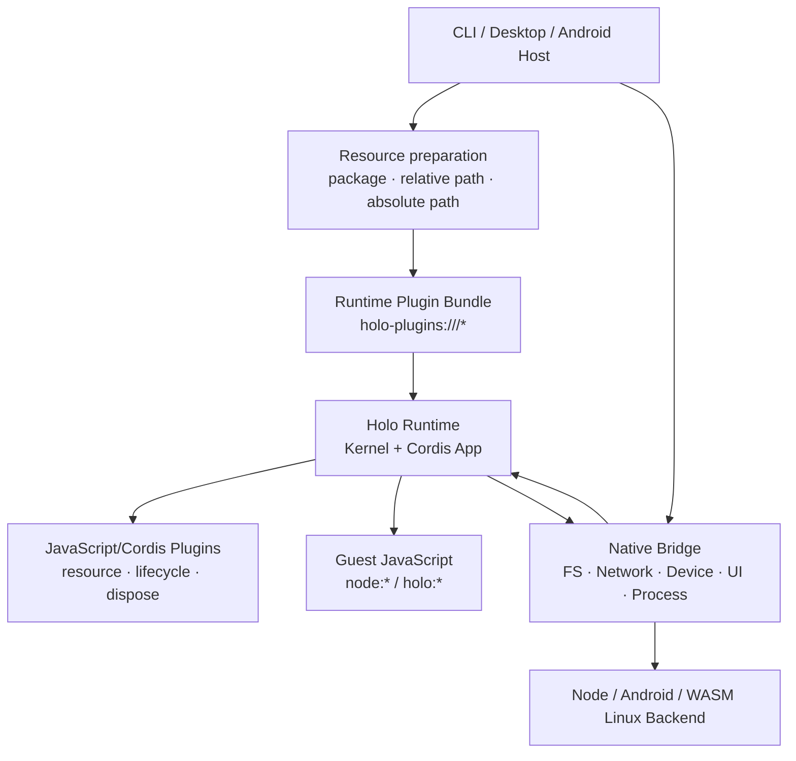

# Runtime plugins and live reload

[简体中文](../../concepts/runtime-plugins.md)

> The Runtime plugin resource and lifecycle foundation is implemented as an M3 sub-track. Node/Desktop supports startup loading and `--watch`; Android currently supports static startup Bundles only. The unified Capability Middleware and the Permission/Audit foundation contracts remain M3 work, so loading an ordinary Cordis plugin does not mean capability interception is complete. See the [support matrix](../capabilities/support-matrix.md) for the exact boundary.

Holonomy uses one plugin model: JavaScript/Cordis plugins executed inside the Runtime. CLI, Desktop, and Android differ only in how they prepare resources; once admitted, every target uses the same Bundle and loader.

## Overall relationship



The Native Host does not implement another plugin API. The trusted launch side loads resource bytes and constructs Bundles, while the Native Host supplies the Resource Manifest, Native Bridge, and Runtime lifecycle. The Service admits startup or update transactions, then the Runtime installs plugins into the generation's Cordis App.

## Code roles

Inside the Runtime, the Kernel/Cordis App, Capability modules, and optional foundation plugins are separate layers. Platform adapters provide only Providers and Native Bridges. The CLI or Native Host prepares plugin resources; the Service owns admission, revisions, and process lifecycle, but does not read a remote caller's local paths.

Current Cordis plugins may depend on the Context supplied by the Runtime and relative modules within their own Bundle; the Runtime does not depend back on a concrete plugin. The public Host contract that connects Capability invocations, Permission, Audit, and enterprise policy to Cordis has not shipped. Until it does, convention-based event names are not a security interception API. These future capabilities will still use JavaScript/Cordis plugins rather than a Native plugin API.

A plugin npm package declares its unified entry through `package.json.holo`:

```json
{
  "name": "@company/holo-permission",
  "holo": {
    "kind": "runtime-plugin",
    "apiVersion": 1,
    "entry": "./dist/index.mjs",
    "configSchema": "./dist/config.schema.json"
  }
}
```

The entry must export a JavaScript plugin installable by the Runtime Cordis App. `enabled`, `export`, and `config` default to `true`, `default`, and `{}` respectively. Optional `integrity` pins the expected Bundle digest.

## Plugin resources

Plugin URLs inside the Runtime use a separate scheme:

```text
holo-plugins:///<plugin-instance-id>/<relative-path>
```

This is separate from immutable `holo:///runtime/*` assets. A Bundle contains its entry, every file, configuration, and integrity. The Runtime never sees npm, pnpm, symlinks, or native Host paths.

The CLI configuration is:

```json
{
  "plugins": [
    {
      "id": "permission",
      "use": "@company/holo-permission",
      "config": { "interactive": true }
    },
    {
      "id": "audit",
      "use": "./plugins/local-audit.mjs"
    },
    {
      "id": "security",
      "use": "/opt/company/holo-plugins/security",
      "enabled": true
    }
  ]
}
```

- packages resolve from the workspace that owns the configuration;
- relative paths beginning with `./` or `../` resolve from the directory containing `holo.config.json`;
- absolute paths require explicit Host-policy permission;
- other strings are package specifiers, and v1 does not accept `file:` URLs;
- `run` never installs dependencies over the network during startup or watch.

The CLI resolves, validates, and builds Bundles from the workspace that owns the configuration, then submits an immutable resource graph with no Host paths to the Service. An Android Host can prepare the same Bundle from APK assets or Host-managed storage. The Service and Runtime never read back into the caller's filesystem.

## `watch` mode

The Node/Desktop command is:

```bash
holonomy run app.mjs --config holo.config.json --watch
```

Whenever the configuration changes, the CLI watcher reads the complete file again. A candidate Bundle reaches the Runtime through the Service revision CAS only after JSON parsing, config Schema, plugin Schema, source, and integrity validation all succeed.

The diff uses unique `plugins[].id` values and array order:

- a new ID loads a plugin;
- removal or disablement unloads its Cordis scope;
- source, export, config, or integrity changes stage a replacement before unloading the old instance;
- reordering updates the declared plugin graph order; the unified Capability Middleware is not public yet, so no business-interception ordering is currently claimed;
- an unchanged entry is not reloaded.

Updates use last-known-good semantics. Invalid JSON, duplicate IDs, Schema errors, or plugin load failures emit diagnostics without tearing down the working graph. The Service publishes a new revision only after Runtime replacement succeeds. Old-graph snapshots and drain deadlines for Capability invocations remain later M3 work and cannot be relied on yet.

V1 covers configuration changes and Bundle diffs after re-resolution, not arbitrary source-file HMR. Deleting the configuration file is not treated as an empty plugin list; unloading every plugin requires a valid `"plugins": []`.

Android/Javet does not use runtime dynamic import. Before startup, the Host composes admitted Bundles into a read-only static module manifest, so plugins are still installed strictly before Guest entry. Dynamic graph replacement on Android is deferred; the CLI rejects Android `--watch` deterministically.

## Non-bypassable boundaries

- System Policy, Snapshot, Authority, and Generation fencing are not unloadable plugins.
- Guest code cannot access the Cordis Context or install, reorder, or unload Host plugins.
- The target Permission/Audit split remains: Holonomy supplies contracts and foundations while the application owns prompts, decisions, persistence, and audit destinations. It is not a published plugin API yet.
- Plugin disposal cleans resources registered through Cordis Context/effect. Bridge-binding cleanup and Capability late-result fencing can be claimed only after the unified plugin contract is connected to the Broker.
