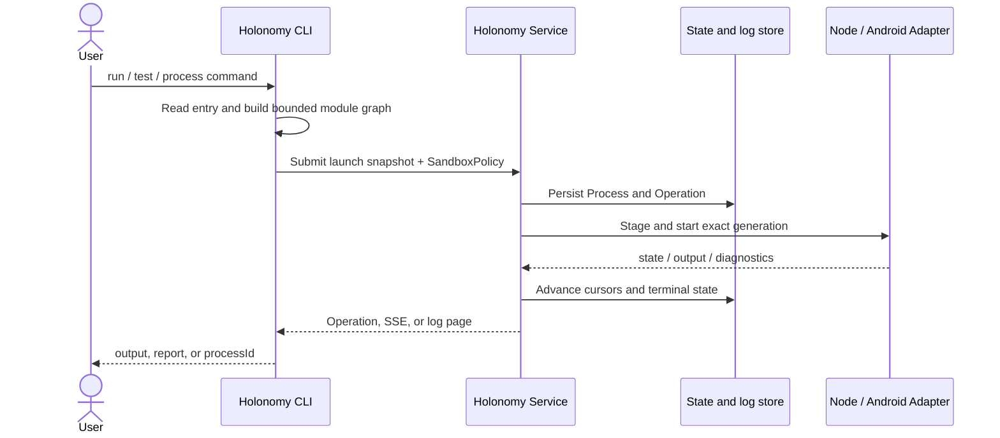

# Service and CLI

[简体中文](../../concepts/service-and-cli.md)

The CLI is the compilation and interaction entry point; the Service is the long-lived control plane.

The CLI reads commands, discovers entries, builds a bounded module graph, generates test wrappers, and renders results. The Service owns devices, processes, logs, fixtures, ADB leases, Network Rules, Inspector leases, recovery, and retention.

Default `--openapi auto` starts or reuses the current user's loopback Service. An explicit remote Service never falls back to local or direct ADB; non-loopback access requires HTTPS and a token.

Single ownership prevents concurrent CLIs from deleting one another's forward, reverse, or session resources and allows detached processes to outlive their creating CLI.
