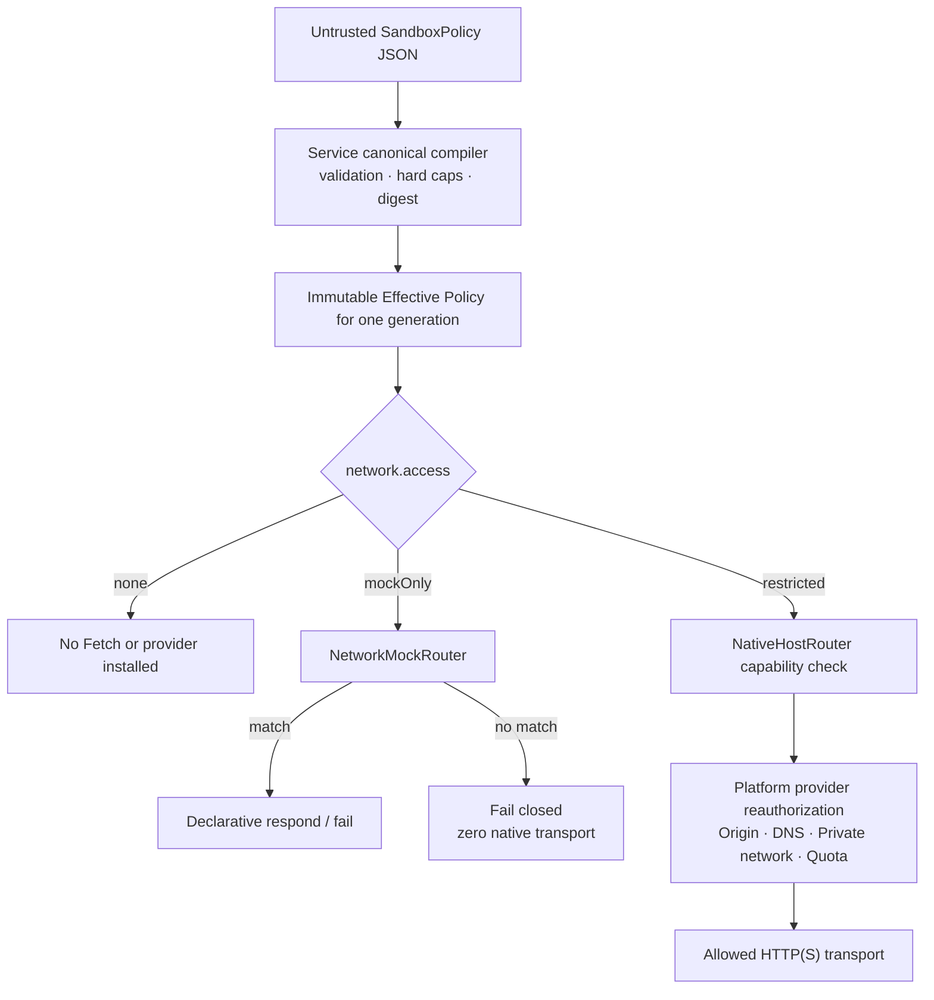

# Configure the sandbox

[简体中文](../../guides/configure-sandbox.md)

Every process has an immutable SandboxPolicy. Missing policy means deny network and filesystem access.

## Deny by default

```json
{
  "schemaVersion": 1,
  "network": { "access": "none" },
  "filesystem": { "access": "none" }
}
```

```sh
pnpm holonomy run examples/basic.mjs --target node --sandbox ./sandbox.json
```

The CLI only reads and submits bounded JSON. The Service is the authoritative compiler; guest input cannot provide principals, capabilities, provider tokens, or compiled authority.



The Service, Runtime Router, and platform provider revalidate at separate boundaries. A mock match never expands real-network authority; passthrough reaches a native provider only when both the `restricted` policy and rule set allow it.

## Network modes

| Network mode | Behavior                                                                                |
| ------------ | --------------------------------------------------------------------------------------- |
| `none`       | Installs no Fetch capability or network provider.                                       |
| `mockOnly`   | Declarative mock only; unmatched requests fail closed and never reach native transport. |
| `restricted` | Allows only listed canonical origins, schemes, private-network policy, and limits.      |

Policy is frozen for one generation. Policy changes require restart; live Network Rules remain constrained by the existing policy.

## Filesystem

`filesystem=none` is supported. `filesystem=sandboxed` currently returns `sandbox.capability_unsupported`; Holonomy never falls back to ambient host paths.

See [SandboxPolicy reference](../reference/sandbox-policy.md).
