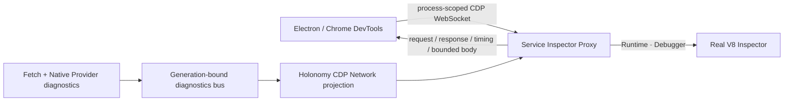

# Debug with DevTools

[简体中文](../../guides/debug-with-devtools.md)

Holonomy creates an independent Inspector lease for each process generation. Runtime and Debugger commands reach the real V8 isolate; the Network domain is generated from Holonomy Fetch diagnostics.

## Start and open

```sh
pnpm holonomy run examples/debuggable.mjs \
  --target node \
  --inspect-brk \
  --devtools
```

Or open an Inspector-enabled detached process:

```sh
pnpm holonomy process inspect <process-id> --devtools
```

`--inspect-brk` enters `waiting_for_debugger`. DevTools `Runtime.runIfWaitingForDebugger` resumes the current generation through the existing Service lifecycle.



Runtime and Debugger use the real Inspector. Network is not a packet-capture proxy; it is a projection jointly produced by the shared Fetch lifecycle and platform-provider diagnostics.

## What you can inspect

- Sources keep original user module URLs; internal modules use `holonomy:///runtime/`.
- Network shows request/response headers, ExtraInfo, status, sizes, Fetch timing, `real`/`mock` source, and bounded bodies.
- Console shows Runtime output and the debugging console.
- Sensitive headers and common query secrets are redacted.

Mock traffic does not fabricate DNS, TCP, TLS, or remote-address details. An unavailable diagnostic body does not mean Fetch failed. Discard stale leases after restart and close the lease when finished.
