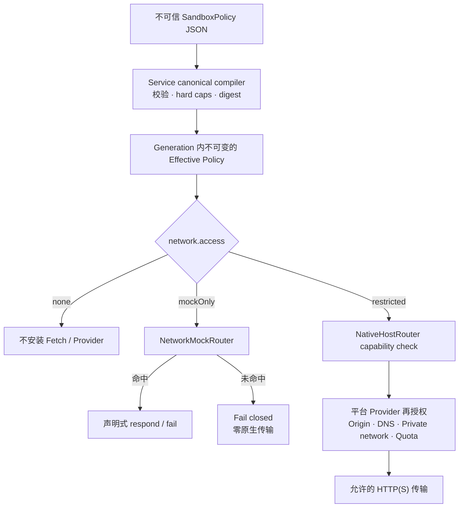

# 配置安全 Sandbox

[English](../en/guides/configure-sandbox.md)

每个进程都有不可变 SandboxPolicy。策略缺失时，网络和文件系统均默认拒绝。

## 默认拒绝

```json
{
  "schemaVersion": 1,
  "network": { "access": "none" },
  "filesystem": { "access": "none" }
}
```

使用策略文件：

```sh
pnpm holonomy run examples/basic.mjs \
  --target node \
  --sandbox ./sandbox.json
```

CLI 只安全读取并提交 JSON；Service 是唯一权威编译器。Guest 不能提交 principal、capability、Provider token 或编译后的 authority。



Service、Runtime Router 和平台 Provider 分层重验。Mock 命中不会扩大真实网络权限；passthrough 只有在 `restricted` 策略和规则集同时允许时才到达原生 Provider。

## 网络模式

| 模式         | 行为                                                        |
| ------------ | ----------------------------------------------------------- |
| `none`       | 不安装 Fetch 能力，也不创建网络 Provider。                  |
| `mockOnly`   | 只允许声明式 Mock，未命中必须 fail closed，原生传输零调用。 |
| `restricted` | 只允许列出的 canonical origin、scheme、私网选择和资源上限。 |

策略在 generation 内冻结。修改策略必须 Restart；运行中只能在现有策略范围内替换 Network Rules。

## 文件系统

`filesystem=none` 已支持。`filesystem=sandboxed` 当前会返回 `sandbox.capability_unsupported`；Holonomy 不会退化为直接暴露宿主路径。

精确字段和限制见 [SandboxPolicy 参考](../reference/sandbox-policy.md)。
