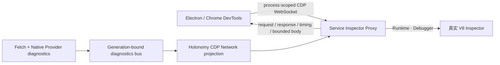

# 使用 DevTools 调试

[English](../en/guides/debug-with-devtools.md)

Holonomy 为每个进程 generation 创建独立 Inspector lease。Runtime 与 Debugger 命令进入真实 V8；Network domain 由 Holonomy Fetch diagnostics 提供。

## 启动并打开

```sh
pnpm holonomy run examples/debuggable.mjs \
  --target node \
  --inspect-brk \
  --devtools
```

或对已经启用 Inspector 的后台进程执行：

```sh
pnpm holonomy process inspect <process-id> --devtools
```

`--inspect-brk` 会进入 `waiting_for_debugger`。DevTools 的 `Runtime.runIfWaitingForDebugger` 会通过现有 Service resume 生命周期安全地继续当前 generation。



Runtime 与 Debugger 透传真实 Inspector；Network 不是抓包代理，而是由共享 Fetch 生命周期和平台 Provider 诊断共同投影。

## 可见内容

- Sources：用户模块保留原始绝对 URL；内部模块使用 `holonomy:///runtime/`。
- Network：请求/响应 headers、ExtraInfo、状态、大小、Fetch timing、`real`/`mock` 来源和有界 response body。
- Console：Runtime 输出与调试 Console。

敏感 headers 和常见敏感 query 会脱敏。Mock 不会伪造不存在的 DNS、TCP、TLS 或远端地址信息；body unavailable 只表示诊断缓存不可用，不代表 Fetch 失败。

Generation 改变后旧 lease 必须丢弃。完成调试后关闭 lease，避免保留无用的本地转发资源。
