# RFC-0001：Holo 标准模块、Runtime Context 与统一能力拦截

| 字段     | 值                                                                                                       |
| -------- | -------------------------------------------------------------------------------------------------------- |
| 状态     | Proposed                                                                                                 |
| 目标阶段 | M2 合同冻结，M2.5 安全能力内核，M3/M3.5 生产能力，M4 Engine Gate                                         |
| 创建日期 | 2026-08-12                                                                                               |
| 影响范围 | Runtime Kernel、Module Loader、NativePort、Service、Node/Desktop Adapter、Android Adapter、Inspector/CDP |
| 公开命名 | `node:*` 优先；Node 不具备的能力使用 `holo:*`                                                            |
| 内部资产 | `holo:///runtime/*`                                                                                      |
| 插件资产 | `holo-plugins:///*`                                                                                      |

本文是内部设计提案，不代表所述能力已经发布。实现状态继续以公开支持矩阵、模块 README、OpenAPI 和实际测试证据为准。

## RFC 结构

本页冻结目标、边界和总体架构；详细合同按职责拆分，并延续统一章节编号：

- [模块命名与 Runtime Context](0001-holo-capability-runtime/modules-and-context.md)：章节 7–9。
- [Invocation Broker 与中间件](0001-holo-capability-runtime/middleware.md)：章节 10–11。
- [Module Facade 与调用模式](0001-holo-capability-runtime/facades-and-invocation-modes.md)：章节 12–13。
- [设备信息与文件系统](0001-holo-capability-runtime/device-and-filesystem.md)：章节 14–15。
- [Engine 安全与受控动态代码](0001-holo-capability-runtime/engine-security.md)：章节 16–17。
- [平台实现、生命周期与安全](0001-holo-capability-runtime/platform-lifecycle-and-security.md)：章节 18–20。
- [验证、发布与开放问题](0001-holo-capability-runtime/verification-and-rollout.md)：章节 21–27。
- [SandboxPolicy 与组合 Capability](0001-holo-capability-runtime/policy-and-capabilities.md)：规范性附录 A。
- [Capability Definition Registry](0001-holo-capability-runtime/capability-definitions.md)：规范性附录 A.1。
- [SandboxPolicy v2 Limits](0001-holo-capability-runtime/policy-limits-v2.md)：规范性附录 A.2。
- [CanonicalResource 与跨 Realm 快照](0001-holo-capability-runtime/resources-and-snapshots.md)：规范性附录 B。
- [Resolved Resource Challenge](0001-holo-capability-runtime/resource-resolution.md)：规范性附录 B.1。
- [Host 系统信息投影](0001-holo-capability-runtime/host-system-projection.md)：规范性附录 C。
- [Host 系统信息值类型](0001-holo-capability-runtime/host-system-value-types.md)：规范性附录 C.1。
- [System Information Operation Registry](0001-holo-capability-runtime/system-operation-registry.md)：规范性附录 C.2。
- [`holo:device` v1 Schema](0001-holo-capability-runtime/device-schema-v1.md)：规范性附录 D。
- [`holo:device` v1 事件](0001-holo-capability-runtime/device-events-v1.md)：规范性附录 D.1。
- [`holo:device` v1 值类型](0001-holo-capability-runtime/device-value-types-v1.md)：规范性附录 D.2。
- [Device Provider Contract](0001-holo-capability-runtime/device-provider-contract.md)：规范性附录 D.3。
- [Network Broker 与 Guest 错误](0001-holo-capability-runtime/network-and-node-errors.md)：规范性附录 E。
- [Guest 错误合同](0001-holo-capability-runtime/error-contract-v1.md)：规范性附录 E.1。
- [Network Broker Schema](0001-holo-capability-runtime/network-schema-v1.md)：规范性附录 E.2。
- [Network Operation Registry](0001-holo-capability-runtime/network-operation-registry.md)：规范性附录 E.3。
- [Engine Gate 与 Execution Realm](0001-holo-capability-runtime/engine-gate-and-realms.md)：规范性附录 F。
- [Runtime Observer](0001-holo-capability-runtime/observer-contract-v1.md)：规范性附录 F.1。
- [里程碑与分层验收](0001-holo-capability-runtime/milestones.md)：规范性附录 G。
- [`node:fs` Sandbox v1](0001-holo-capability-runtime/filesystem-schema-v1.md)：规范性附录 H。
- [`node:fs` Operation Registry](0001-holo-capability-runtime/filesystem-operation-registry.md)：规范性附录 H.1。
- [公共基础合同类型](0001-holo-capability-runtime/core-contract-types.md)：规范性附录 I。
- [`node:child_process` 与可选 Linux Backend](0001-holo-capability-runtime/process-and-linux-backend.md)：规范性附录 J。
- [`node:child_process` Operation Registry](0001-holo-capability-runtime/process-operation-registry.md)：规范性附录 J.1。
- [ChildProcess Resource 与 stdio Protocol](0001-holo-capability-runtime/process-resource-protocol.md)：规范性附录 J.2。
- [Cordis Runtime Plugin、资源包与 Watch](0001-holo-capability-runtime/runtime-plugins-and-watch.md)：规范性附录 K。

## 1. 摘要

Holonomy 将提供一套跨 Node、Desktop 和 Android 的受控能力模型：

1. Node 已定义的 JavaScript API继续使用`node:*`，例如`node:fs`、`node:os`和受控`node:child_process`；Linux/Bash只作为Host可选Process Provider。
2. Node 没有标准接口的跨设备能力使用 `holo:*`，例如 `holo:device` 和 `holo:runtime`。
3. 所有可授权的 Guest capability operation 进入同一个 Invocation Broker 和可信宿主 Koa Middleware；resource continuation 等 system-only operation 仍进 Broker，但不重复业务授权。
4. SandboxPolicy 只定义 Runtime 的最大能力和硬限额；授权 UI、授权缓存、业务身份和允许策略由接入宿主负责。
5. Runtime Context 由 Android/Desktop/Service 宿主在创建 Runtime 时提供，并分别投影给 Host Middleware、Guest 和 Inspector。
6. `eval`、Function constructors、Wasm 和动态 import 不是简单禁用，而是由 Engine Gate、Module Loader 和硬限额受控。
7. 能力拦截、Engine 准入和运行监控是三个不同平面，不能混成一套高开销的通用 AOP。
8. 每个 Runtime generation 拥有一个 Cordis App；Host 只提供已验证的 JavaScript plugin resources 与 Native Bridge，插件由 Runtime 自己加载。

核心安全不变量是：

> Guest 的任何执行路径最多只能抵达受控 Module Facade、Invocation Broker 或 Engine Gate，绝不能直接取得宿主原生对象、Provider token 或未经授权的系统能力。

## 2. 背景与问题

当前 Holonomy 已具备以下基础：

- 平台中立的 Runtime Composer、Event Loop、Module Loader 和 Native Bridge；
- Node 子进程中的隔离 VM Context、Synthetic Module、受控模块图和 Host Bridge；
- Android generation-bound Runtime Supervisor、NativeHost、Inspector 和 Provider 边界；
- SandboxPolicy、Bridge 注入 authority、Provider 二次授权、资源句柄和稳定错误；
- Service 所有的进程、设备、日志、Network Rules 和 Inspector 生命周期。

但仍缺少一个统一答案来处理以下需求：

- 宿主如何在 Runtime 创建时注入任意业务上下文；
- Guest 和 CDP 如何只看到宿主选择公开的上下文；
- `node:fs`、`node:os`、`holo:device` 等调用如何统一被拦截；
- 接入应用如何用自己的授权窗口、规则和存储决定是否继续调用；
- 同步、callback 和 Promise API 如何共享相同权限语义；
- `eval`、`new Function`、Wasm、动态 import、Inspector 和反射如何避免绕过；
- Desktop/Node 如何在不 fork Node.js 的前提下逐步获得更细的 V8 控制能力；
- 设备信息如何跨 Android、Desktop 和 Node 标准化而不泄露不可重置标识符。
- 外部包如何通过Node-compatible child process运行受控Git/Bash/CLI，而不让Linux Backend绕过Holo Policy。
- CLI、Desktop 与 Native Host 如何用同一种资源格式装载 Cordis 插件，并在开发态安全地热更新插件图。

## 3. 目标

本 RFC 目标如下：

- 冻结模块命名、操作标识、调用上下文和中间件语义；
- 冻结 SandboxPolicy、组合 Capability、CanonicalResource 和跨 Realm 快照；
- 让同一个 Host Middleware 模型覆盖 `node:*` 和 `holo:*`；
- 允许宿主传入任意有界 Runtime Context，而不是由 Holonomy 枚举业务主体类型；
- 让 Android、Desktop 和 Node Adapter 共享合同但保留平台实现差异；
- 保留 Node API 的同步、callback 和 Promise 使用体验；
- 支持受控动态代码生成，不通过替换全局 `eval` 破坏 JavaScript 语义；
- 把拦截、授权产品逻辑、Provider 安全和运行观测的职责分离；
- 给出可分阶段交付、可验证、可回滚的实现路线。
- 冻结 Runtime、Capability、Plugin、Provider 与应用代码的包边界，以及唯一的 JavaScript/Cordis 插件模型。

## 4. 非目标

本 RFC 不做以下事情：

- 不定义“应用”“插件”“小程序”等业务主体枚举；
- 不内置授权弹窗、文案、授权时长、Grant key 或持久化数据库；
- 不重新实现 Node.js，不要求立即 fork Node 或自研完整 V8 Engine；
- 不用 Proxy 代替 Module Loader、Provider 授权或 OS Sandbox；
- 不承诺拦截每一个普通 JavaScript 函数调用；
- 不把 Host 私有上下文、原始设备标识符或敏感网络拓扑暴露给 Guest/CDP；
- 不在本提案中声称 `node:fs` 生产 Provider、`holo:device` 或 V8 Native Hook 已经完成。
- 不从零重写Linux用户态内核、CPU执行器或CLI生态；虚拟Linux能力只通过可替换Process Backend评估与交付。
- 不建立 Android/iOS 原生插件体系；Native Host 只准备资源、Bridge 与 Runtime 生命周期。

## 5. 规范用语

本文中的“必须”“不得”“应该”和“可以”分别对应 MUST、MUST NOT、SHOULD 和 MAY。

术语：

- **Guest**：在 Holonomy Runtime 内执行的不可信或低可信 JavaScript。
- **Host**：创建并拥有 Runtime 的 Android、Desktop、Node Service 或可信 Embedder。
- **Provider**：执行真实文件、网络、设备或平台操作的可信实现。
- **Broker**：把标准模块操作路由到 Host Middleware 和 Provider 的唯一入口。
- **Middleware**：可信 Host 注册的 Koa 风格能力调用中间件。
- **Engine Gate**：V8/Engine 在代码生成、Wasm 或模块准入前执行的安全门。
- **Observer**：只读、旁路、有界的运行事件消费者。
- **Runtime Plugin**：由可信 Host 提供资源、在 Runtime 的 Cordis App 中执行的 JavaScript 插件。

## 6. 总体架构

```mermaid
flowchart LR
    Host["Android / Desktop / Service Host"]
    Resources["Verified Runtime resources<br/>holo-plugins:///*"]
    Factory["Runtime Factory"]
    Cordis["Generation-bound Cordis App"]
    Guest["Guest JavaScript"]
    Loader["Controlled Module Loader"]
    Facade["node:* / holo:* Facades"]
    Broker["Invocation Broker"]
    Policy["Invocation SandboxPolicy"]
    Middleware["Invocation Koa Middleware"]
    Provider["Platform Providers"]
    Gate["Engine Gate"]
    EnginePolicy["Engine hard policy"]
    EngineMiddleware["Engine Gate Middleware"]
    Engine["V8 compile decision"]
    Observer["Bounded Runtime Observers"]
    CDP["CDP / DevTools"]

    Host -->|"RuntimeCreationSpec + Context"| Factory
    Host --> Resources
    Resources --> Cordis
    Factory --> Cordis
    Cordis --> Guest
    Guest --> Loader
    Loader --> Facade
    Facade --> Broker
    Broker --> Policy
    Policy --> Middleware
    Middleware --> Provider
    Guest -->|"eval / Function / Wasm"| Gate
    Gate --> EnginePolicy
    EnginePolicy --> EngineMiddleware
    EngineMiddleware --> Engine
    Guest -.-> Observer
    Provider -.-> Observer
    Factory --> CDP
```



固定顺序如下：

```text
Guest own-data 参数快照与 Schema 校验
  → CanonicalResource 构造与 Capability 分支冻结
    → SandboxPolicy 最大权限检查
    → 不可移除的系统中间件
      → 宿主 Koa Middleware
        → Provider 二次授权与执行
      → 结果 Schema、配额与脱敏
  → 有界终态审计事件
```

Engine Gate 使用独立流水线：`EngineGateRequest` → code-generation Policy → 不可移除的系统 Gate → Host Gate Middleware → V8 allow/deny。它不调用普通 Provider，也不复用可返回任意结果的 Invocation Middleware。

宿主中间件不得放大 SandboxPolicy；Provider 不得相信 Broker 已经完成授权，必须按注入的 principal、generation、capability 和资源绑定再次校验。
