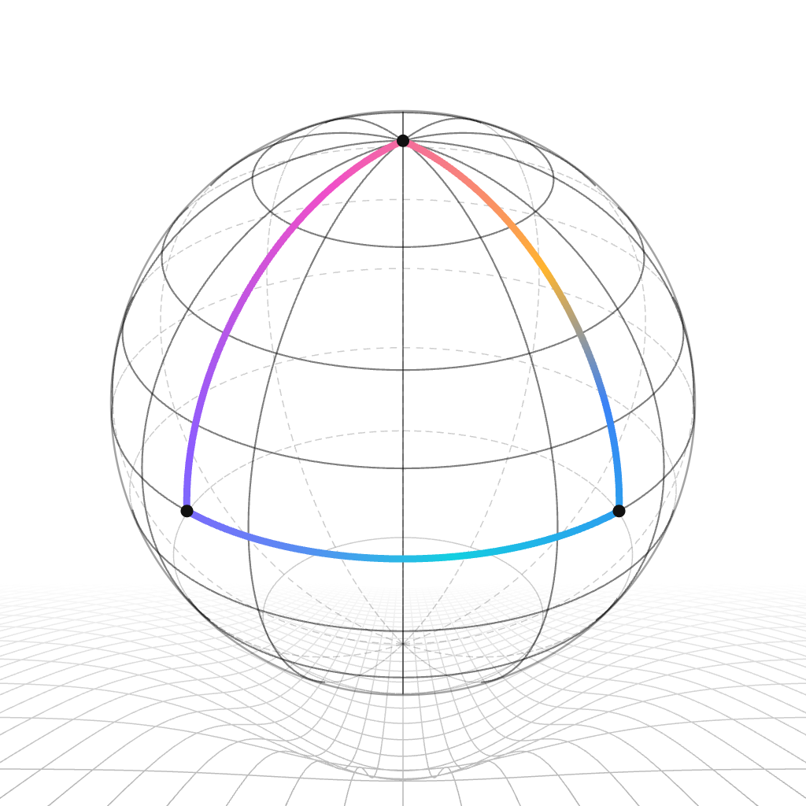

<p align="center">
  <picture>
    <source media="(prefers-color-scheme: dark)" srcset="./assets/holonomy-icon-dark.png">
    <source media="(prefers-color-scheme: light)" srcset="./assets/holonomy-icon-light.png">
    
  </picture>
</p>

<p align="center">
  <a href="https://github.com/oneworks-ai/holonomy/blob/main/LICENSE"></a>
</p>

<p align="center">
  <a href="./README.md">English</a> | 简体中文
</p>

<h1 align="center">Holonomy</h1>

<p align="center"><strong>一个运行时，跨越每一种载体。</strong></p>

## 介绍

Holonomy 是一个面向原生宿主、能力安全且平台中立的 JavaScript 运行时。它提供边界明确的 Node 兼容模块、Web API 和宿主契约，同时不让 Android、V8 或任何单一引擎成为运行时语义的所有者。

## 快速开始

```bash
pnpm install
pnpm typecheck
pnpm build
pnpm test
```

## 许可证

[MIT](./LICENSE)
